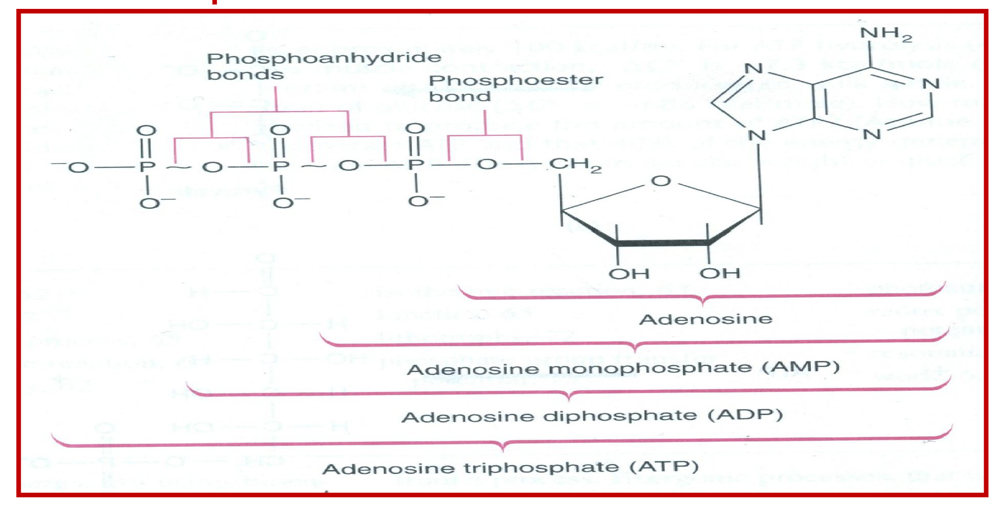
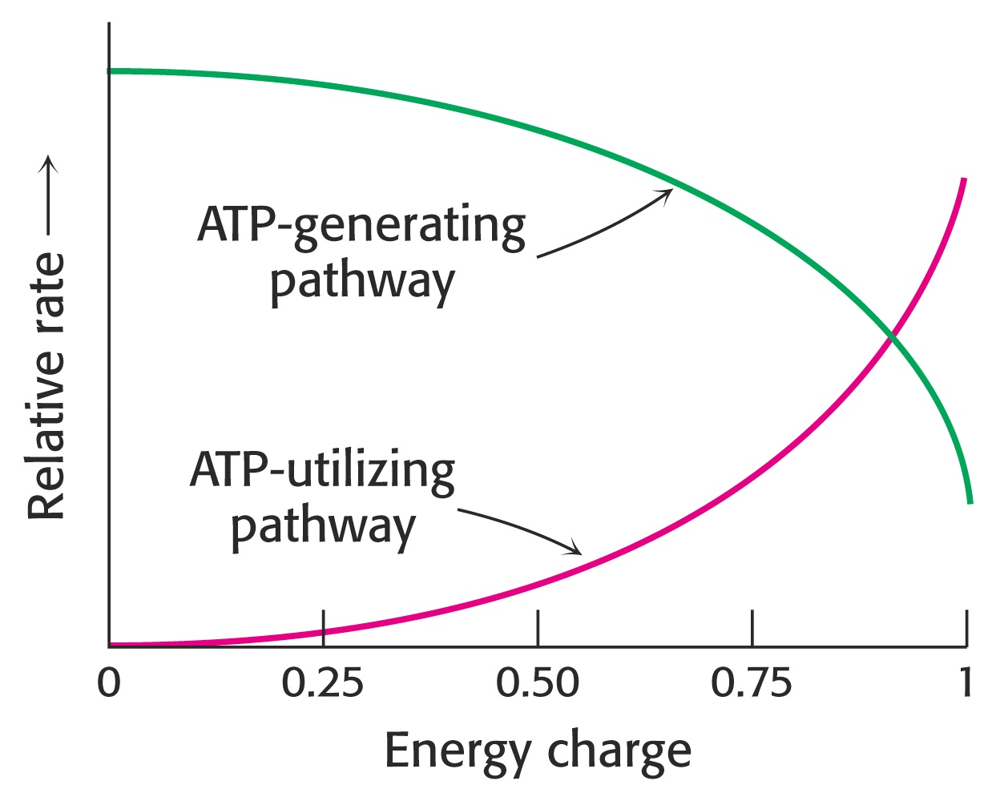
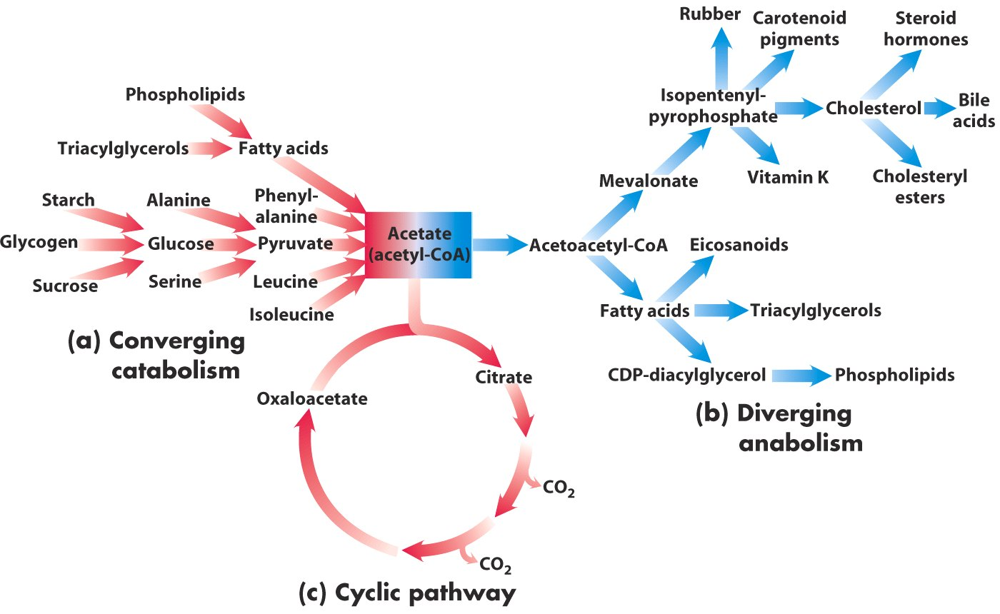
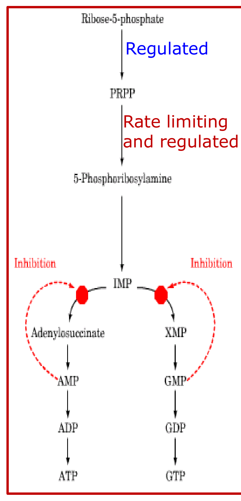
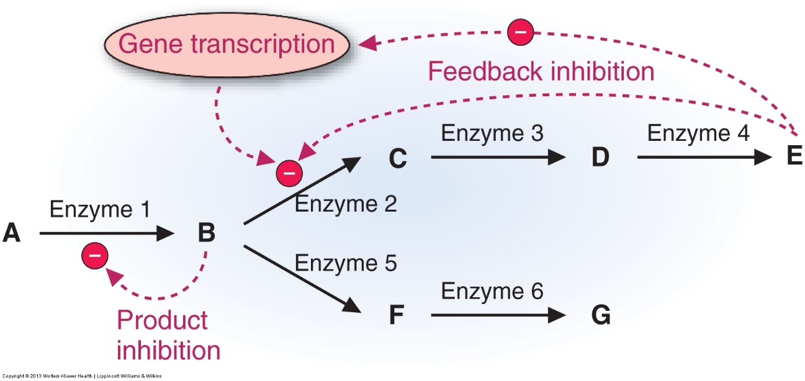
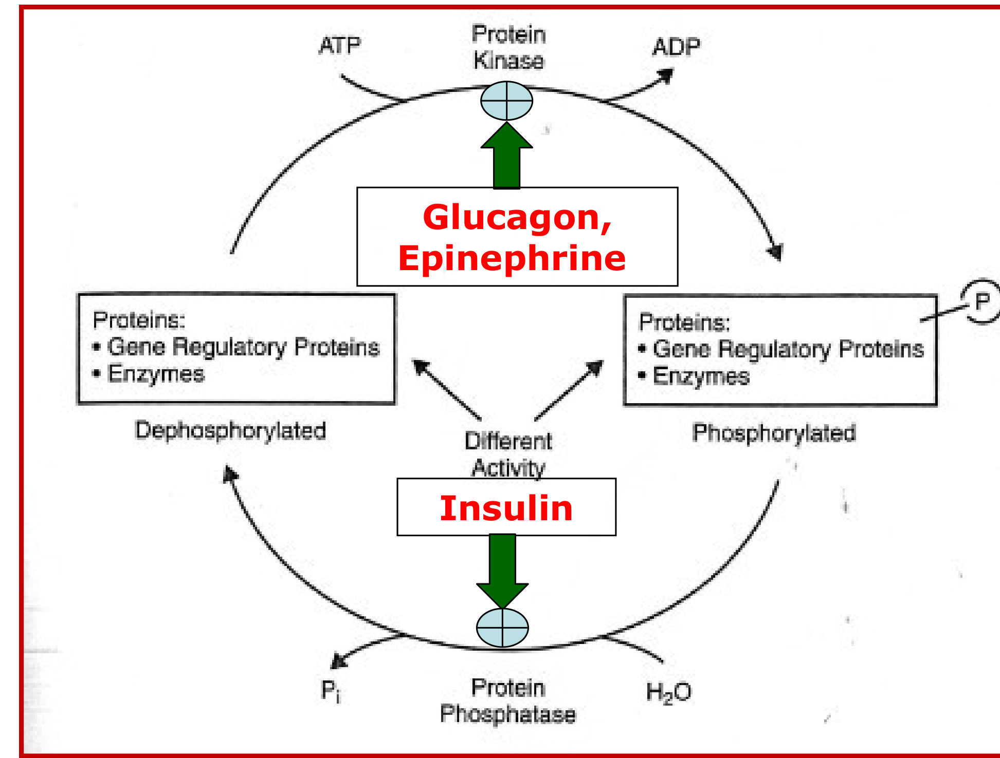
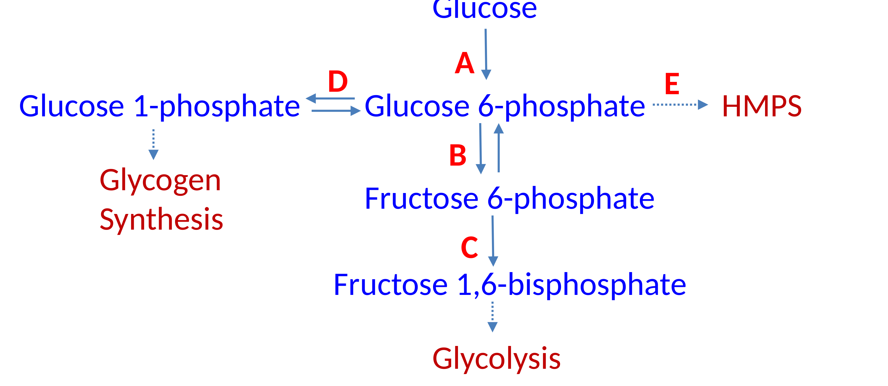

# Lecture 01 — Overview of Metabolic Pathways

*Medical Biochemistry & Genetics I  ·  Fall 2026  ·  Week 1, Session 1*

*Session Tue 8/4, 1:00–2:00 PM  ·  Required reading: Lippincott Ch. 8, Introduction to Metabolism ·  Assessed on Foundation Exam \#1, Mon 8/17, 11 AM–1 PM*


> **HOW TO READ THIS —**
>
> **★ MUST KNOW** (red band) = highest-yield, most likely to be tested directly.  **Bold** = a term, number or name that could be a fill-in-the-blank answer.  
> **VS boxes** = pairs that are routinely confused; the **underlined red word** is the single feature that tells them apart.

## Orientation · The whole system on one page

```text
METABOLISM — the sum of all chemical changes in a cell, tissue or body
  ├── CATABOLISM  (degradative · convergent · exergonic)
  │    Macronutrients (carbohydrate · lipid · protein) + Micronutrients (vitamins · minerals)
  │       ↓  digestion → absorption → uptake by cells
  │    OXIDATION  =  loss of hydrogen, not gain of oxygen
  │       • Glycolysis →→ acetyl-CoA   • TCA cycle →→ CO₂ + H₂O   • HMP shunt → NADPH + pentoses (no ATP)
  │    Burn carbohydrate (↑ insulin) →→ acetyl-CoA + ATP   Burn fat (↓ insulin) →→ acetyl-CoA + ATP
  │       ↓  hydrogens land on NAD⁺, NADP⁺, FAD
  │    NADH · FADH₂ → ATP     NADPH ✗ ATP  — it carries hydrogen instead
  │
  └── ANABOLISM  (synthetic · divergent · endergonic)  CH₃–CH₂–CH₂–COOH a fatty acid: needs C and H
         • ATP — universal requirement   • Acetyl-CoA — source of carbon   • NADPH — source of hydrogen
         • ↑ Insulin — the anabolic hormone, driving every -genesis except gluconeogenesis and ketogenesis
```

Macronutrients cannot be used as eaten. They are digested to their simplest absorbable forms — glucose, fatty acids, amino acids — absorbed, and taken up by cells. There **catabolism** oxidizes them, stripping hydrogens off rather than adding oxygen. NAD⁺, NADP⁺ and FAD catch those hydrogens. The electron transport chain cashes NADH and FADH₂ in for ATP; NADPH is spent on building instead. When ATP is plentiful the cell flips to **anabolism**, which needs the three things catabolism just made — energy, carbon and hydrogen — plus the hormonal signal that the fed state has arrived.

## Objective 1 · Compare and contrast catabolic and anabolic pathways

### What a metabolic pathway is

Cellular reactions rarely occur in isolation. They are organized into multi-step sequences called **pathways**, in which the product of one enzyme is the substrate of the next. Pathways intersect, so carbohydrate, lipid and protein metabolism are not three separate subjects but one integrated network sharing intermediates. Every pathway is either **degradative (catabolic)** or **synthetic (anabolic)**; a pathway that regenerates its own starting component is a **cycle**.

### Catabolism

Catabolism breaks complex molecules down to a few simple end products — **CO₂, H₂O and NH₃**. It is **convergent**: many dietary molecules funnel into a handful of common intermediates. It is **exergonic**, releasing free energy stepwise rather than all at once and banking it as ATP. And it is **oxidative**, so it consumes oxidized coenzymes.

Degradation releases energy in **three stages**. Stage 1 hydrolyzes complex molecules into their building blocks: proteins to amino acids, polysaccharides to monosaccharides, triacylglycerols to free fatty acids and glycerol. Stage 2 degrades those building blocks to **acetyl-CoA** and a few other simple molecules, capturing a small amount of ATP. Stage 3 oxidizes acetyl-CoA in the TCA cycle, generating most of the ATP as electrons flow from NADH and FADH₂ to oxygen. Ethanol enters at acetyl-CoA: alcohol supplies real calories, not empty ones.

> **★ MUST KNOW —** Biological oxidation is **dehydrogenation**: substrates are oxidized by **losing hydrogen**, not by gaining oxygen.

Every hydrogen removed must be accepted by a carrier, and which of the three coenzymes accepts it decides what the cell can do with the electrons afterwards. A **reducing equivalent** is the electron-plus-proton package being moved; NAD⁺ takes it as a hydride (two electrons, one proton), releasing the second proton free: NAD⁺ + 2H → NADH + H⁺.

**The three catabolic (oxidative) pathways**

| Pathway | Substrates handled | Yields | Note |
|----|----|----|----|
| **Glycolysis** | Mainly carbohydrate | ATP; carbon skeletons; feeds acetyl-CoA | Most glucose goes this way |
| **TCA cycle** · = citric acid cycle · = tricarboxylic acid cycle | **Carbohydrate, lipid and protein** — all converge here | CO₂ + H₂O, NADH, FADH₂ → ATP | Starting molecule is **acetyl-CoA**; many amino acids also enter at other points as their carbon skeletons |
| **HMP shunt** · = pentose phosphate pathway | A minority of glucose | **NADPH + pentoses — no ATP** | The alternate oxidative route; its oxidative phase is irreversible, its non-oxidative phase is reversible sugar interconversion |

> **★ MUST KNOW —** The **TCA cycle is the common oxidative pathway** for carbohydrate, lipid **and** protein.

> **★ MUST KNOW —** The **HMP shunt yields NADPH and pentoses, never ATP**.

> **VS — NADH vs NADPH — one phosphate, opposite jobs**
>
> **NADH (from NAD⁺) —** The pool is kept **oxidized**, ready to accept electrons from catabolism and hand them to the electron transport chain. **Indirect source of ATP.** FADH₂ does the same job but is produced in smaller quantity.
>
> **NADPH (from NADP⁺) —** The pool is kept **reduced**, ready to donate electrons into biosynthesis. **Never a source of ATP** — it is the hydrogen donor for reductive synthesis.

The two differ by a single phosphate on the 2′-OH of the adenosine ribose. Chemically they transfer the same two electrons; the phosphate is a tag that lets enzymes tell the pools apart, so the cell can run them at opposite redox poise for opposite purposes.

> **★ MUST KNOW —** **NADPH is never a source of ATP.** NADH and FADH₂ are, indirectly, through the electron transport chain.

### Anabolism

Anabolism assembles complex products from a few simple precursors, so it is **divergent** — the mirror image of catabolism's convergence. It is **endergonic** and must be paid for. Most of its reactions are **reductive syntheses** — syntheses that consume hydrogen — and that hydrogen comes from NADPH.

**The four requirements for anabolism**

| Requirement | Supplies | Detail |
|----|----|----|
| **ATP** (or GTP) | Energy | The universal requirement. Ligases use ATP — glutamine synthesis by glutamate-ammonia ligase; PEP carboxykinase uses GTP |
| **Acetyl-CoA** | Carbon skeleton | Two-carbon acetyl unit; the carbon source for fatty acid and cholesterol synthesis |
| **NADPH** | Hydrogen | Reducing power for reductive synthesis (NADH serves in a few reactions) |
| **↑ Insulin** | The signal | The major anabolic hormone; induces the key enzymes of anabolic pathways |

> **★ MUST KNOW —** Anabolism's four requirements: **ATP · acetyl-CoA · NADPH · insulin**.

> **★ MUST KNOW —** Insulin drives every *-genesis* **except gluconeogenesis and ketogenesis** — the two fasting programs.

### ATP and the energy charge

A **high-energy bond** is a covalent bond whose hydrolysis releases a useful amount of energy to do work, conventionally drawn with a squiggle (**~**). ATP is the cell's most commonly used high-energy compound, and its energy is defined by the hydrolysis reaction.




***Which ATP bonds are "high energy."** The two **phosphoanhydride** bonds joining the β and γ phosphates each release −7.3 kcal/mol on hydrolysis and are the high-energy bonds. The **phosphoester** bond linking the α phosphate to the ribose is not. Removing the γ phosphate leaves ADP, which therefore still holds one high-energy bond; removing both leaves AMP, which holds none.*


> **★ MUST KNOW —** ATP has **two** high-energy bonds and ADP **one**; ΔG°′ of hydrolysis = **−7,300 cal/mol (−7.3 kcal/mol)** for each.

The cell's overall energy status is summarized by the **energy charge**, which runs from **0** (all AMP) to **1** (all ATP). Like intracellular pH, it is buffered, and most cells hold it between **0.8 and 0.95**. Because catabolism generates ATP and anabolism spends it, energy charge is the switch that decides which direction runs.




***Energy charge sets the direction of metabolism.** The two curves cross near 0.9, inside the buffered physiological range, so small shifts in energy charge produce large opposite swings in the two pathway types. As energy charge rises, ATP-generating (catabolic) pathways slow and ATP-utilizing (anabolic) pathways accelerate.*


> **★ MUST KNOW —** Anabolism requires a **high** energy charge. It is never turned on by a low-energy state.

> **VS — Exergonic vs endergonic  ·  Convergent vs divergent**
>
> **Exergonic —** **Releases** free energy; proceeds spontaneously. Catabolism.
>
> **Endergonic —** **Consumes** free energy; must be coupled to ATP hydrolysis. Anabolism.
>
> **Convergent —** Many substrates → **few** end products. Catabolism.
>
> **Divergent —** Few precursors → **many** products. Anabolism.




***Acetyl-CoA is the hinge between the two halves of metabolism.** On the left, starch, glycogen, sucrose, triacylglycerols, phospholipids and amino acids all converge to acetate (acetyl-CoA). On the right, that same acetyl-CoA diverges into cholesterol, bile acids, steroid hormones, vitamin K, fatty acids, triacylglycerols, eicosanoids and phospholipids. Below, the TCA cycle is drawn as the third shape a pathway can take — a cycle, which regenerates oxaloacetate and releases the carbons as CO₂.*


### Which fuel, and when

Carbohydrate is the **preferred fuel**, lipid the **concentrated fuel**, and protein primarily supplies **building blocks** though it can also be burned for energy. Both carbohydrate and fat converge on acetyl-CoA and yield ATP; what differs is the hormonal state in which each is burned: carbohydrate in the fed, **high-insulin** state, fat in the **low-insulin** state.

**Catabolism vs anabolism at a glance**

|  | Catabolism | Anabolism |
|----|----|----|
| **Direction** | Breaks something down | Builds something up |
| **Shape** | Convergent | Divergent |
| **End products** | Simple molecules (CO₂, H₂O, NH₃) | Complex molecules (proteins, polysaccharides, lipids, nucleic acids) |
| **Starting material** | Energy-containing nutrients: carbohydrate, fat, protein | Precursors: amino acids, sugars, fatty acids, nitrogenous bases |
| **Thermodynamics** | Exergonic — releases energy | Endergonic — requires energy |
| **Redox** | Oxidative; consumes NAD⁺, NADP⁺, FAD | Reductive; consumes NADPH |
| **Energy charge** | Stimulated by **low** energy charge | Stimulated by **high** energy charge |

## Objective 2 · Key components of metabolism and the activated carriers

### Nutrients

Nothing can be catabolized without nutrients, and macronutrients alone are not enough. **Micronutrients — vitamins and minerals —** become the coenzymes and cofactors that the enzymes handling carbohydrate, lipid and protein depend on. Most foods deliver a mixture of both, along with toxins and xenobiotics the cell must detoxify and excrete.

Whether a nutrient must be eaten daily depends on whether the body can stockpile it.

| Stored in the body | Not stored — required on a regular, almost daily basis |
|----|----|
| Carbohydrate as **glycogen** · Fat as **triacylglycerols** · Amino acids in **muscle protein** and the **free amino acid pool** · **Fat-soluble vitamins** · Some **minerals** (e.g. iron) | **Water-soluble vitamins** — which is precisely why deficiency of a water-soluble vitamin shows up as a metabolic disease. Since most activated carriers are coenzymes derived from water-soluble vitamins, a deficiency disables a whole class of reactions at once. |

> **CLINICAL —** Ill health follows from **too little** of a nutrient — **beriberi** (thiamine), **pellagra** (niacin), **protein-energy malnutrition** — or from **too much**, as with alcohol. Some essential nutrients are toxic or deadly in excess, including **water, salt and iron**.

### Enzymes and the reactions they catalyze

Very few reactions in an organism proceed without catalysis, so a metabolic pathway is in practice a **multi-step, enzyme-catalyzed sequence**. Enzymes are largely protein, and each converts substrate to product at a defined rate per unit time. The same six chemical operations recur across all of metabolism.

**The six recurring reaction types in metabolism**

| Type | What happens |
|----|----|
| **Oxidation–reduction** | Electron transfer |
| **Ligation requiring ATP cleavage** | Formation of covalent bonds, e.g. carbon–carbon bonds |
| **Isomerization** | Rearrangement of atoms to form isomers |
| **Group transfer** | Transfer of a functional group from one molecule to another |
| **Hydrolytic** | Cleavage of bonds by the addition of water |
| **Addition or removal of functional groups** | Addition of functional groups to double bonds, or their removal to form double bonds |

### Activated carriers

An **activated carrier** is a coenzyme that holds a chemical group or a pair of electrons in an activated form and shuttles it between reactions. Learning metabolism is largely a matter of knowing which carrier moves which group, and which vitamin it is built from.

**Activated carriers, the group each carries, and its vitamin precursor**

| Carrier in activated form | Group carried | Vitamin precursor |
|----|----|----|
| **ATP** | Phosphoryl | — |
| **NADH** and **NADPH** | Electrons | **Niacin** (nicotinate) |
| **FADH₂** | Electrons | **Riboflavin** (B₂) |
| **FMNH₂** | Electrons | **Riboflavin** (B₂) |
| **Coenzyme A** | Acyl | **Pantothenate** (B₅) |
| **Lipoamide** | Acyl | **Lipoic acid** |
| **Thiamine pyrophosphate** (TPP) | Aldehyde | **Thiamine** (B₁) |
| **Biotin** | CO₂ | **Biotin** |
| **Tetrahydrofolate** (THF) | One-carbon units | **Folate** |
| **S-Adenosylmethionine** (SAM) | Methyl | — |
| **Uridine diphosphate glucose** (UDP-glucose) | Glucose — used for glycogen synthesis | — |
| **Cytidine diphosphate diacylglycerol** | Phosphatidate | — |
| **Nucleoside triphosphates** | Nucleotides | — |

## Objective 3 · Common themes in pathways; committed and rate-limiting steps

Five features recur in every pathway you will meet: **irreversibility · committed step · rate-limiting step · regulation · compartmentalization**. The first three are structural properties of the pathway; the last two are how the cell exploits them.

```text
A  ──E1──▶  B  ◀──E2──▶  C  ──E3──▶  D  ◀──E4──▶  E
▶ one-way = irreversible  ·  ◀▶ two-way = reversible
A pathway may contain more than one irreversible step. Here E1, first and irreversible, is the committed and rate-limiting step.
```

### Irreversibility

Irreversible steps exist so that opposing pathways can be separated. If the anabolic and catabolic routes between two compounds used an identical reaction sequence, running both at once would be wasteful, and the cell could not regulate them independently. Fatty acid synthesis and fatty acid oxidation are the standing example: they must not run simultaneously or fat metabolism becomes futile.

An irreversible step has a large **negative ΔG** under physiological conditions, making it one-way, and it is the **bottleneck** of the pathway — block it and flux downstream falls. That is why the cell regulates these steps. Slowing is not stopping: no pathway is ever fully shut down; one runs while its opposite is damped.

### Committed and rate-limiting steps

> **VS — Committed step vs rate-limiting step**
>
> **Committed step —** The **first** irreversible reaction, early in the pathway, that commits its product to continue down that pathway and no other. Generally the target of regulation.  
>   
> **Found only in linear pathways.**
>
> **Rate-limiting step —** The **slowest** reaction in the pathway, generally with the highest activation energy. Its velocity sets the overall flux of metabolites. Subject to intense regulation, both positive and negative.  
>   
> **Present in every pathway, cyclic ones included.**

Both are irreversible, and in many pathways — though not all — the committed step is also the rate-limiting step. What distinguishes them is *why* each matters: the committed step for its position at a branch point, the rate-limiting step for its speed. Two separate quantities are at work — the highest **activation energy** makes it slowest, a large negative **ΔG** makes it irreversible.

> **★ MUST KNOW —** **Cyclic pathways have no committed step** — though they do have a rate-limiting step.

> **★ MUST KNOW —** **Rate-limiting ⟹ regulated. Regulated ⇏ rate-limiting.**




***Why "regulated" and "rate-limiting" are not the same label.** In purine nucleotide synthesis, ribose-5-phosphate → PRPP is regulated but not rate-limiting; the next step, PRPP → 5-phosphoribosylamine, is *both* rate-limiting and regulated. Further down, IMP branches to AMP and GMP, and each end product inhibits its own branch — regulation at a third set of points entirely.*


## Objective 4 · Mechanisms of regulation

Enzyme activity is regulated by **activation or inhibition**, so that the flux through each pathway matches what the body currently needs. Regulation is aimed principally at the enzymes catalyzing irreversible steps — the committed and rate-limiting ones — but other steps are regulated too. Mechanisms sort into three groups by what they change and how fast.

| Group | Changes | Time course | Mechanisms |
|----|----|----|----|
| **Long-term** | Enzyme **quantity** | Hours to days | Induction · repression · degradation |
| **Short-term** | Enzyme **activity** | Minutes to hours | Substrate concentration · product inhibition · proenzyme activation · reversible covalent modification · allosteric regulation |
| **Compartmentalization** | Enzyme **location** | Structural | Segregation into organelles, multienzyme complexes, or separate tissues |

> **★ MUST KNOW —** **Long-term regulation alters enzyme quantity; short-term regulation modifies enzyme activity.**

### Long-term regulation

Regulating gene expression controls both the quantity of an enzyme and the rate at which it is made. Because it works at the level of transcription it is slow — hours to days — and it suits enzymes needed at a particular stage rather than those in constant use. Degradation lowers enzyme quantity by two routes: the **ubiquitin–proteasome pathway** and the **lysosomal pathway**.

> **VS — Induction vs repression**
>
> **Induction —** **Increases** the rate of enzyme synthesis by enhancing gene transcription → more enzyme protein. Insulin induces the key enzymes of anabolic pathways.
>
> **Repression —** **Decreases** the rate of enzyme synthesis by decreasing gene transcription → less enzyme protein.

### Short-term regulation

Short-term mechanisms carry out most of the moment-to-moment physiological control of metabolism. They act on enzyme molecules that already exist, so they usually leave the concentration of enzyme protein unchanged, and they are reversible and rapid. Proenzyme activation is the one exception on both counts, and that exception is examinable.

#### 1 · Substrate concentration

The velocity of every enzyme depends on the concentration of its substrate, so an enzyme with a high K<sub>m</sub> is effectively controlled by how much substrate is around. The liver is the chief site of metabolism; after a meal, glucose transporters carry glucose into hepatocytes, where **glucokinase** phosphorylates it in bulk to glucose-6-phosphate for glycogen synthesis. Phosphorylation is the point of no return — a charged phosphate traps the sugar inside the cell and commits it to further metabolism.

#### 2 · Product inhibition

Once enough immediate product has accumulated, it signals its own enzyme to slow down. Peripheral tissues run **hexokinase**, whose low K<sub>m</sub> lets it phosphorylate glucose efficiently even during fasting; what restrains it is accumulation of its product, glucose-6-phosphate. The two kinases together illustrate that different key enzymes are governed by different mechanisms.

> **VS — Hexokinase vs glucokinase**
>
> **Hexokinase —** Peripheral tissues · **low K<sub>m</sub>** · works during fasting · **inhibited by glucose-6-phosphate** · not substrate-regulated
>
> **Glucokinase —** Liver · **high K<sub>m</sub>** · works only after a meal · **not inhibited by glucose-6-phosphate** · regulated by substrate concentration; induced by insulin

> **★ MUST KNOW —** **Glucokinase** is controlled by **substrate concentration**; **hexokinase** is controlled by **product (G6P) inhibition**.

Glucokinase is **inactive during fasting and activated after a meal** (strictly, it is never switched off — its high K<sub>m</sub> holds it far below V<sub>max</sub> at fasting glucose concentrations).

> **VS — Product inhibition vs feedback inhibition**
>
> **Product inhibition —** Inhibition by the **immediate** product of that same enzyme.
>
> **Feedback inhibition —** Inhibition by the **final** product of the pathway, acting on an enzyme further back.




***Three regulatory reaches, one diagram.** B, the immediate product of enzyme 1, inhibits enzyme 1 — **product inhibition**. E, the final product of the upper branch, inhibits enzyme 2 several steps upstream — **feedback inhibition**. E also suppresses transcription of the gene for enzyme 2, the slow route that lowers enzyme quantity rather than activity. A branch point (B) is where committing decisions are made: carbon can go to E or to G.*


#### 3 · Proenzyme (zymogen) activation

Some enzymes are synthesized as inactive precursors called **proenzymes** or **zymogens**, made in abundance, stored in secretory granules, and activated by proteolytic cleavage only once they reach their site of action. Pancreatic proteases work this way, as do the blood clotting factors, where each factor is activated by the previous one in the cascade. Activation is fast, which makes it a good emergency mechanism, but cleaving a peptide bond cannot be undone.

> **★ MUST KNOW —** **Zymogen activation is not reversible** — and, unlike other short-term mechanisms, it does raise the amount of active enzyme.

> **CLINICAL — ACUTE PANCREATITIS —** Pancreatic proteases must stay inactive inside the acinar cell. If **trypsinogen is converted to trypsin within the cell** — sporadically, or through an inherited defect — the active protease digests the cell that made it. The result is acinar autolysis and **acute pancreatitis**.

#### 4 · Reversible covalent modification

Attaching a group to an enzyme changes its activity rapidly and transiently. Phosphoryl is much the most important; methyl, uridyl, adenylyl and ADP-ribosyl groups are also used. A **protein kinase** transfers phosphate from ATP onto the **hydroxyl group of a serine, threonine or tyrosine residue**, and a **phosphoprotein phosphatase** hydrolytically removes it, releasing P<sub>i</sub>. Whether the phosphorylated form is the active or the inactive one depends on the enzyme.

What makes this the master switch of intermediary metabolism is that it is all-or-none and hormonally driven. At any point in the fed–fasting cycle, *all* target proteins are phosphorylated or *all* are dephosphorylated, so entire opposing pathways switch on and off together.

> **★ MUST KNOW —** **Insulin always dephosphorylates** the key enzymes; **glucagon and epinephrine always phosphorylate** them.

It follows that any pathway insulin supports is **active in the dephosphorylated form**. Glucagon and epinephrine are the counter-regulatory hormones opposing insulin, and between them these hormones control most of intermediary metabolism. Underneath sits the adenylyl cyclase cascade: glucagon or epinephrine binds a G protein–coupled receptor, the G<sub>α</sub>–GTP complex activates **adenylyl cyclase**, which converts ATP to **cAMP**; cAMP binds the two regulatory subunits of **protein kinase A**, releasing its catalytic subunits to phosphorylate targets on serine and threonine. Insulin opposes this cascade, leaving phosphatase activity dominant.




***One cycle, two hormonal directions.** Protein kinase consumes ATP to add phosphate, driven by glucagon and epinephrine; protein phosphatase consumes water to remove it as P<sub>i</sub>, driven by insulin. The dephosphorylated and phosphorylated forms of the target — enzymes and gene regulatory proteins alike — have different activities, so the same molecule does different work depending on where in the fed–fasting cycle the body is.*


#### 5 · Allosteric regulation

An **allosteric modifier** binds a site other than the active site and changes the enzyme's activity within minutes. **Allosteric activators** raise activity, **allosteric inhibitors** lower it. This is how metabolite levels themselves report back to the regulated enzymes of a pathway.

### Compartmentalization

Separating enzymes in space is regulation by architecture, and it operates at two levels.

| Level | Purpose | Example |
|----|----|----|
| **Cellular** | Segregate opposing catabolic and anabolic pathways within one cell; enzymes may be cytosolic, mitochondrial, or both, or bundled into multienzyme complexes | Fatty acid **oxidation in mitochondria**; fatty acid **synthesis in cytoplasm** |
| **Tissue** | Carry out organ-specific processes; also makes enzyme or product levels usable as a clinical indicator of tissue damage | Urea synthesis in the **liver**; steroid hormone synthesis in the **adrenals** |

> **CLINICAL — COMPARTMENTALIZATION AS A DIAGNOSTIC —** The urea cycle operates in the liver, and urea is measured as **blood urea nitrogen (BUN)**. A **low BUN** therefore points to liver damage — from alcohol, toxins or other hepatic injury — because a damaged liver cannot make urea.

### Timeline of regulation

| Event                    | Time            |
|--------------------------|-----------------|
| Substrate stimulation    | Minutes         |
| Product inhibition       | Minutes         |
| Allosteric regulation    | Minutes         |
| Covalent modification    | Minutes – hours |
| Synthesis or degradation | Hours – days    |

The rule behind the table: a mechanism that touches an existing enzyme acts in minutes; a mechanism that has to go through the gene takes hours to days.

## Part 5 · Self-test

Cover the answers. Say each one out loud before you look — the goal is recall, not recognition.

1.  Define metabolism in one sentence, state the relationship between consecutive enzymes in a pathway, and say what a pathway is called when it regenerates its own starting component. **Answer:** The sum of all chemical changes in a cell, tissue or body. The product of one enzyme is the substrate of the next. A cycle.
2.  Oxidation in the body occurs by what chemical change, and what are the three acceptors? **Answer:** Loss of hydrogen (dehydrogenation), not gain of oxygen. NAD⁺, NADP⁺ and FAD → NADH + H⁺, NADPH, FADH₂.
3.  Name the three stages of catabolism, and the simple end products it arrives at. **Answer:** 1 — hydrolysis of complex molecules to building blocks. 2 — building blocks to acetyl-CoA and a few simple molecules, with a little ATP. 3 — oxidation of acetyl-CoA in the TCA cycle, generating most of the ATP. End products: CO₂, H₂O and NH₃.
4.  Name the three oxidative pathways, what each handles, and which yields no ATP. **Answer:** Glycolysis (mainly carbohydrate); TCA cycle (common to carbohydrate, lipid and protein, starting from acetyl-CoA); HMP shunt — NADPH + pentoses, **no ATP**.
5.  Which carriers are indirect sources of ATP and which is never? **Answer:** NADH and FADH₂ are, via the electron transport chain; FADH₂ is produced in smaller quantity. NADPH is never — it donates hydrogen for reductive synthesis.
6.  Structurally, how do NADH and NADPH differ, and why does the cell bother? **Answer:** By one phosphate on the adenosine ribose. The tag lets enzymes tell the pools apart, so NAD⁺ can be held oxidized for catabolism while NADPH is held reduced for biosynthesis.
7.  Define reductive synthesis and name its hydrogen donor. **Answer:** Any synthesis that consumes hydrogen. NADPH.
8.  List the four requirements for anabolism, what each supplies, and which two "-geneses" insulin does not support. **Answer:** ATP (energy; GTP for some reactions), acetyl-CoA (carbon), NADPH (hydrogen), insulin (the signal). Insulin does not support gluconeogenesis or ketogenesis — both are fasting, low-insulin programs.
9.  Give one anabolic reaction that uses ATP and one that uses GTP. **Answer:** Glutamine formation by glutamate-ammonia ligase uses ATP; PEP carboxykinase uses GTP.
10. Define a high-energy bond; how many are in ATP and in ADP, what type are they, and what is ΔG°′ of hydrolysis? **Answer:** A covalent bond whose hydrolysis releases a useful amount of energy to perform work, drawn with a squiggle (~). Two in ATP (the β and γ phosphoanhydride bonds), one in ADP, −7,300 cal/mol (−7.3 kcal/mol) each. The α-to-ribose bond is a phosphoester and is not high energy.
11. Energy charge: what range, what range in real cells, and what does a high value do? **Answer:** 0 (all AMP) to 1 (all ATP); buffered at 0.8–0.95 in most cells. High energy charge inhibits catabolic pathways and stimulates anabolic ones.
12. Which of the following is a characteristic of anabolic pathways: convergent; breaks something down; stimulated by low energy charge; requires energy; end products are simple molecules? **Answer:** **Requires energy.** All four distractors describe catabolism.
13. Anabolism: does it break down complex molecules, is it exergonic, is it oxidative, does it require NADPH, does it produce NADH? **Answer:** Only **requires NADPH**. The other four describe catabolism.
14. Which fuel is "preferred," which is "concentrated," and in which insulin state is each burned? **Answer:** Carbohydrate is preferred and burned in the high-insulin fed state; lipid is concentrated and burned in the low-insulin state. Protein supplies building blocks but can also be burned.
15. Which nutrients are stored, and which must be consumed regularly? **Answer:** Stored: glycogen, triacylglycerol, muscle protein and the free amino acid pool, fat-soluble vitamins, some minerals such as iron. Not stored: water-soluble vitamins.
16. Name two diseases of nutrient deficiency and three nutrients that are toxic in excess. **Answer:** Beriberi (thiamine), pellagra (niacin), protein-energy malnutrition. Toxic in excess: water, salt, iron — and alcohol.
17. Name the six recurring reaction types in metabolism. **Answer:** Oxidation–reduction; ligation requiring ATP cleavage; isomerization; group transfer; hydrolytic; addition or removal of functional groups.
18. Vitamin precursor for NAD⁺/NADP⁺, FAD and FMN, CoA, TPP, THF, lipoamide? **Answer:** Niacin; riboflavin; pantothenate; thiamine; folate; lipoic acid.
19. Group carried by ATP, CoA, biotin, THF, SAM, UDP-glucose, CDP-diacylglycerol, TPP? **Answer:** Phosphoryl; acyl; CO₂; one-carbon units; methyl; glucose; phosphatidate; aldehyde.
20. Name the five common themes in metabolic pathways, and say why anabolic and catabolic routes cannot use identical reaction sequences. **Answer:** Irreversibility, committed step, rate-limiting step, regulation, compartmentalization. Identical sequences would be wasteful (futile cycling) and could not be separately regulated — fatty acid synthesis versus oxidation is the standing example. No pathway is ever fully shut down; one runs while its opposite is damped.
21. Define the committed step — where is it found, and where never? **Answer:** The first irreversible reaction, early in a linear pathway, committing its product to that pathway; generally the target of regulation; often but not always also rate-limiting. Never in cyclic pathways, which still have a rate-limiting step.
22. Define the rate-limiting step in four ways, and say which property makes a step irreversible versus rate-limiting. **Answer:** Slowest reaction in the pathway; generally the highest activation energy; its velocity sets overall flux; subject to intense positive and negative regulation. A large negative ΔG makes a step irreversible; the highest activation energy makes it slowest, hence rate-limiting. Different quantities.
23. State the logical relationship between "rate-limiting" and "regulated." **Answer:** Rate-limiting ⟹ regulated, always. Regulated ⟹ rate-limiting, not always. A pathway may also have more than one irreversible step.
24. In the branched pathway below, which is the rate-limiting and committed step of glycolysis? **Answer:** **C** — fructose-6-phosphate → fructose-1,6-bisphosphate. A and B lie above branch points, so their product can still leave for glycogen synthesis (D) or the HMP shunt (E); only C commits carbon irreversibly to glycolysis.
    

    

    
25. Which regulatory group changes enzyme quantity, which changes activity, and what is the time course of each mechanism? **Answer:** Long-term changes quantity over hours to days; short-term modifies activity over minutes to hours and is reversible and rapid. Substrate stimulation, product inhibition and allosteric regulation act in minutes; covalent modification minutes–hours; synthesis or degradation hours–days.
26. Contrast induction and repression, and name the two routes of enzyme degradation. **Answer:** Induction raises the rate of enzyme synthesis by enhancing gene transcription; repression lowers it. Degradation via the ubiquitin–proteasome pathway and the lysosomal pathway.
27. Name the five short-term mechanisms. **Answer:** Substrate concentration; product inhibition; proenzyme activation; reversible covalent modification; allosteric regulation.
28. Contrast glucokinase and hexokinase in five ways, and say why the cell phosphorylates glucose the moment it arrives. **Answer:** GK: liver, high K<sub>m</sub>, active only after a meal, **not** inhibited by G6P, induced by insulin. HK: peripheral tissues, low K<sub>m</sub>, still works in fasting, **is** inhibited by G6P, not substrate-regulated. The charge traps glucose inside the cell — an irreversible exit — and commits it to further metabolism.
29. Product inhibition vs feedback inhibition? **Answer:** Product inhibition is by the immediate product of that enzyme; feedback inhibition is by the final product of the pathway, acting upstream.
30. Which short-term mechanism is irreversible, why is that a disadvantage, where are these enzymes stored, and what happens when the mechanism misfires? **Answer:** Proenzyme (zymogen) activation — proteolytic cleavage cannot be undone, and it does raise active enzyme levels. Synthesized in abundance and stored in secretory granules, activated on release; blood clotting factors are a second example, each activated by the preceding factor. Intracellular trypsinogen activation → trypsin → acinar cell autolysis → acute pancreatitis.
31. Which residues are phosphorylated, by which enzyme, what reverses it, and what do insulin, glucagon and epinephrine do to key enzymes? **Answer:** The hydroxyls of serine, threonine and tyrosine. A protein kinase adds phosphate from ATP; a phosphoprotein phosphatase removes it as P<sub>i</sub>. Methyl, uridyl, adenylyl and ADP-ribosyl groups are also attached. Insulin always dephosphorylates; glucagon and epinephrine always phosphorylate, so insulin-supported pathways are active dephosphorylated. At any moment all targets are phosphorylated or all dephosphorylated.
32. Trace the signaling from glucagon to a phosphorylated enzyme, and define an allosteric modifier. **Answer:** Glucagon → G protein–coupled receptor → G<sub>α</sub>–GTP → adenylyl cyclase → ATP to cAMP → cAMP releases the catalytic subunits of protein kinase A → phosphorylation of Ser/Thr on target enzymes. An allosteric modifier binds outside the active site and changes activity within minutes; the two kinds are allosteric activators and allosteric inhibitors.
33. Give one cellular and one tissue example of compartmentalization, plus one clinical use. **Answer:** Fatty acid oxidation in mitochondria vs synthesis in cytoplasm, and enzymes bundled into multienzyme complexes; urea synthesis in liver, steroid hormones in adrenals; low BUN suggests liver damage from alcohol, toxins or other hepatic injury.
34. Hormones regulate a pathway by altering the rate of expression of the genes encoding its enzymes. What is the time frame? **Answer:** Hours to days — regulating gene expression alters the amount of protein encoded, which is slow. This is long-term regulation.

## Part 6 · Rapid-review sheet

**Bold = highest-yield. If you review one page, review this one.**

### Catabolism vs anabolism

**Catabolism:** convergent · complex→simple · exergonic · oxidative · releases energy → ATP · **triggered by LOW energy charge**  
**Anabolism:** divergent · simple→complex · endergonic · reductive · spends ATP · **triggered by HIGH energy charge — never a low one** · insulin

### Oxidation in the body

**= LOSS OF HYDROGEN, not gain of oxygen** (dehydrogenation)  
NAD⁺ → NADH + H⁺ · NADP⁺ → NADPH · FAD → FADH₂  
**NADH and FADH₂ → ATP (indirectly, via the ETC). NADPH → NEVER ATP** — it is the H donor for reductive synthesis

### Three stages of catabolism

① complex molecules → building blocks ② building blocks → **acetyl-CoA** (a little ATP) ③ acetyl-CoA oxidized in TCA → most of the ATP

### The three oxidative pathways

**Glycolysis** — mainly carbohydrate → acetyl-CoA  
**TCA cycle** — **common to carbohydrate + lipid + protein**; starts at acetyl-CoA → CO₂ + H₂O, NADH, FADH₂  
**HMP shunt** — alternate; **NADPH + pentoses, NO ATP**

### Anabolism needs

① **ATP** (universal; sometimes GTP) ② **acetyl-CoA** = carbon ③ **NADPH** = hydrogen ④ **↑ insulin**  
**Insulin supports every "-genesis" EXCEPT gluconeogenesis and ketogenesis**

### ATP · energy charge

ATP = **2** high-energy phosphoanhydride bonds (β, γ); ADP = **1**; AMP = 0; ΔG°′ = **−7.3 kcal/mol** each  
α-to-ribose = phosphoester, not high energy  
EC range **0–1**; buffered at **0.8–0.95**; high EC → catabolism ↓, anabolism ↑

### Activated carriers

ATP → phosphoryl  
NADH / NADPH → electrons — **niacin**  
FADH₂, FMNH₂ → electrons — **riboflavin**  
Coenzyme A → acyl — **pantothenate**  
Lipoamide → acyl — **lipoic acid**  
TPP → aldehyde — **thiamine**  
Biotin → CO₂ — **biotin**  
THF → one-carbon — **folate**  
SAM → methyl · UDP-glucose → glucose  
CDP-diacylglycerol → phosphatidate · NTPs → nucleotides  
Most are coenzymes from water-soluble vitamins — the ones the body does not store.

### Six reaction types

Oxidation–reduction · ATP-driven ligation · isomerization · group transfer · hydrolysis · addition/removal of functional groups

### Five common themes

Irreversibility · committed step · rate-limiting step · regulation · compartmentalization  
**A pathway may have more than one irreversible step, and steps other than the committed / rate-limiting ones can also be regulated.**

### Committed vs rate-limiting

**Committed:** irreversible · early · linear pathways only · target of regulation · **absent from cycles**  
**Rate-limiting:** irreversible · **slowest** · **highest E<sub>a</sub>** · sets overall flux · intensely regulated  
**Rate-limiting ⟹ regulated. Regulated ⇏ rate-limiting.**  
Irreversibility comes from large negative **ΔG**; slowness from high **E<sub>a</sub>**  
**No pathway is ever fully shut down** — one is active while the opposing one slows

### Long vs short term

**LONG = enzyme QUANTITY** · gene level · **hours–days** · induction / repression / degradation (ubiquitin-proteasome, lysosomal)  
**SHORT = enzyme ACTIVITY** · **minutes–hours** · reversible & rapid  
**COMPARTMENTALIZATION = enzyme LOCATION** · structural

### Five short-term mechanisms

① substrate concentration — **glucokinase**  
② product inhibition — **hexokinase ← G6P**  
③ proenzyme activation — **NOT reversible**; raises enzyme amount  
④ reversible covalent modification — Ser / Thr / Tyr −OH  
⑤ allosteric regulation — activators / inhibitors  
**Product inhibition = immediate product. Feedback inhibition = final product.**

### Hexokinase vs glucokinase

**HK:** peripheral · low K<sub>m</sub> · works in fasting · **inhibited by G6P**  
**GK:** liver · high K<sub>m</sub> · **only after a meal** · **NOT inhibited by G6P** · induced by insulin

### Phosphorylation rule

**Insulin → always DEphosphorylates** (phosphatase, H₂O → P<sub>i</sub>)  
**Glucagon / epinephrine → always PHOSPHORYLATE** (kinase, uses ATP) — the counter-regulatory hormones  
Route: GPCR → G<sub>α</sub>–GTP → adenylyl cyclase → cAMP → PKA → Ser/Thr  
At any moment ALL targets are phosphorylated OR ALL dephosphorylated  
**Insulin-driven pathways are active dephosphorylated.**

### Compartmentalization

**Cellular:** FA oxidation = **mitochondria**; FA synthesis = **cytoplasm**; also multienzyme complexes  
**Tissue:** urea = **liver**; steroid hormones = **adrenals**  
**Clinical:** low BUN → possible liver damage

### Timeline

Substrate stimulation · product inhibition · allosteric — **minutes**  
Covalent modification — **minutes–hours**  
**Synthesis / degradation — hours–days**  
Touches an existing enzyme → minutes. Goes through the gene → hours–days.

### Clinical hooks

**Acute pancreatitis** — intracellular trypsinogen activation → acinar autolysis; can be inherited  
**Low BUN** — liver damage (urea cycle is hepatic)  
**Beriberi** — thiamine · **Pellagra** — niacin · **PEM** — protein-energy malnutrition  
Toxic in excess: alcohol, water, salt, iron
