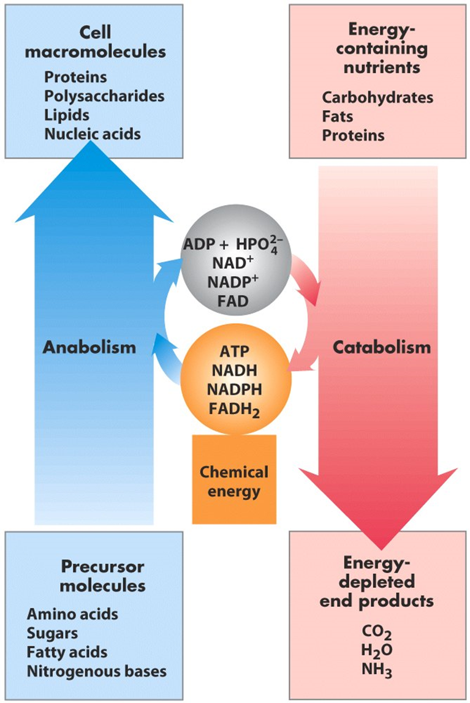
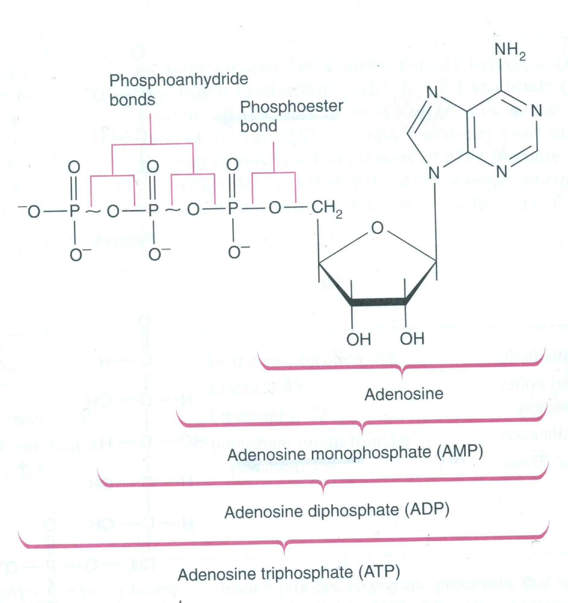
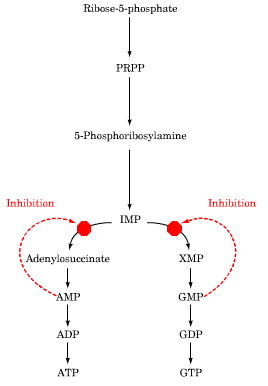
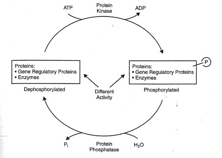

*Medical Biochemistry & Genetics I  ·  Fall 2026  ·  Week 1, Session 1*

# Lecture 01 — Overview of Metabolic Pathways

*Complete study guide — PowerPoint (all 41 slides + speaker notes) and lecture transcript, reconciled*

|  |  |
|----|----|
| **Instructor** | Shilpika Bagh, MBBS, MD — Course Director, Medical Biochemistry |
| **Session** | Tuesday 8/4, 1:00–2:00 PM, in person (Poll Everywhere participation) |
| **Required reading** | Lippincott Illustrated Reviews: Biochemistry, Ch. 8 (Introduction to Metabolism)  · Suggested Marks' Basic Medical Biochemistry 5th ed., Ch. 1 and Ch. 9 |
| **Assessed on** | Foundation Exam \#1, 8/17, 11 AM–1 PM (with Enzymes & Kinetics, ETC, Thermodynamics primer, Signal Transduction, Carbohydrate digestion, Carbohydrate structures) |

> **CONCEPT — How to read this document**
>
> **Blue** = the concept, the why. **Gold** = the specifics to memorize. **Red** = traps and "always/never" statements Dr. Bagh repeated. **Green** = clinical. **Grey** = corrections where the slides or the spoken lecture were imprecise. Each fact appears once, in whichever block it belongs to — the blue blocks explain, the gold blocks list, and they do not restate each other.
>
> **What this lecture actually is:** scaffolding, not content. Dr. Bagh said some version of *"you will learn this later"* more than twenty times. There is not a single pathway here you must be able to draw. What you must own is the vocabulary and the rules every later pathway will obey — catabolism vs anabolism, which carrier does which job, what makes a step irreversible, what "committed" and "rate-limiting" mean, and the ways a cell turns an enzyme up or down.

## Part 0  /  The professor's own mental map

Dr. Bagh opened by putting her *own* handwritten summary on screen before any slide content — "that's how I think the lecture has to be introduced." It is the spine of everything that follows. (The scanned image on slide 4 is cut off at the bottom; the missing lines, which she spoke, are restored here.)

```
METABOLISM
 ├── CATABOLISM
 │     Macronutrients (carbohydrate, lipid, protein) + Micronutrients (vitamins, minerals)
 │        |
 │        v
 │     OXIDATION   (in the body = LOSS OF HYDROGEN, not gain of oxygen)
 │        - Glycolysis  -->  acetyl-CoA
 │        - TCA cycle   -->  CO2 + H2O
 │        - HMP shunt   -->  NADPH + pentoses      (NO ATP)
 │
 │     Burn carbohydrate (^ insulin) --> acetyl-CoA + ATP
 │     Burn fat          (v insulin) --> acetyl-CoA + ATP
 │
 │     NADH --> ATP        NADPH --X--> ATP
 │
 └── ANABOLISM     CH3-CH2-CH2-COOH   (e.g. a fatty acid - needs C and H)
       - ATP         .... the universal requirement
       - Acetyl-CoA  .... source of CARBON
       - NADPH       .... source of HYDROGEN
       - ^ Insulin   .... the anabolic hormone
                          EXCEPT: gluconeogenesis, ketogenesis  (crossed out)
```

> **CONCEPT — The whole lecture in one paragraph**
>
> You eat macronutrients. They can't be used as eaten, so they are digested to their simplest absorbable forms, absorbed, and taken up by cells. Inside the cell, **catabolism** oxidizes them — and oxidation here means *stripping hydrogens off*, not adding oxygen. Those hydrogens must land somewhere, and the things that catch them are NAD<sup>+</sup>, NADP<sup>+</sup> and FAD, which become NADH, NADPH and FADH<sub>2</sub>. NADH and FADH<sub>2</sub> are cashed in for ATP. Once ATP is plentiful — a **high energy charge** — the cell flips to **anabolism**. Building needs energy (ATP), carbon (acetyl-CoA) and hydrogen (NADPH), all three of which came out of catabolism. The hormone that turns the anabolic program on is insulin.

## Objective 1  /  Compare and contrast catabolic and anabolic pathways

> **CONCEPT — What metabolism is**
>
> **Metabolism** is the sum of all chemical changes in a cell, tissue, or body. Reactions almost never happen in isolation — they are organized into multi-step **pathways**, and pathways intersect into one integrated network. Every pathway is either **degradative (catabolic)** or **synthetic (anabolic)**.
>
> The Stanford "Pathways of Human Metabolism" map on slide 3 (also in the repo as FullSubwayMap222.pdf) exists to make one point: carbohydrate, lipid and protein metabolism are not three separate subjects — they share intermediates and feed each other. You are not expected to memorize it, only to keep returning to it as each pathway is taught.



***Slide 6 — the central wheel.** Two counter-rotating arrows sharing one hub: catabolism converts the **oxidized** carriers (ADP + HPO<sub>4</sub><sup>2−</sup>, NAD<sup>+</sup>, NADP<sup>+</sup>, FAD) into the **charged** ones (ATP, NADH, NADPH, FADH<sub>2</sub>), and anabolism spends them.*

### 1.1  Catabolism

> **MEMORIZE — The five defining features (slide 7, verbatim)**
>
> 1.  **Breakdown** of complex molecules into simple ones
> 2.  Generally **exergonic** — proceeds with release of free energy
> 3.  **Releases energy**, captured as ATP
> 4.  **Oxidative** — NAD<sup>+</sup> / NADP<sup>+</sup> → NADH / NADPH (and FAD → FADH<sub>2</sub>)
> 5.  **Provides the energy for the synthesis** of complex molecules — it exists to fund anabolism

> **HIGH-YIELD / TRAP — Her most-repeated point in the entire lecture**
>
> **Oxidation in the human body is by LOSS OF HYDROGEN, not gain of oxygen.** She said this at least eight times. Biological oxidation is *dehydrogenation* — hence the enzymes are called **dehydrogenases**. Her follow-on question, asked and answered repeatedly: *"and who accepts those hydrogens?"* The **acceptors of reducing equivalents** — **NAD<sup>+</sup>, NADP<sup>+</sup>, FAD**. She defined a reducing equivalent as **2H<sup>+</sup> + 2e<sup>−</sup>**.

> **CLARIFICATION — Precision on what each acceptor actually takes**
>
> Strictly, a "reducing equivalent" is one electron (or one hydrogen atom); the 2H<sup>+</sup> + 2e<sup>−</sup> she describes is what a dehydrogenase removes from the substrate, so her usage is right in context. The two acceptors then differ:
>
> - **NAD<sup>+</sup>** accepts a **hydride (H<sup>−</sup> = 1H<sup>+</sup> + 2e<sup>−</sup>)**; the other proton is released into solution — which is why it is always written **NADH + H<sup>+</sup>**, a detail she was careful about.
> - **FAD** accepts **both** hydrogens (2H<sup>+</sup> + 2e<sup>−</sup>) → **FADH<sub>2</sub>**, releasing no free H<sup>+</sup>.

#### The three oxidative (catabolic) pathways

She listed this triad roughly six separate times. If one fact from Objective 1 is tested, it is likely this.

| Pathway | What it mainly oxidizes | What it produces | Source of ATP? |
|----|----|----|----|
| **Glycolysis** | Mainly **carbohydrate** | Pyruvate → acetyl-CoA; NADH; some ATP | Yes |
| **TCA cycle** · = citric acid cycle = tricarboxylic acid cycle — three names, one cycle | **Common final pathway** for carbohydrate, lipid *and* protein; all three converge on acetyl-CoA, the cycle's starting molecule | NADH + H<sup>+</sup>, FADH<sub>2</sub>, CO<sub>2</sub> | Yes (indirectly, via the carriers) |
| **HMP shunt** · = hexose monophosphate shunt = pentose phosphate pathway | Glucose-6-phosphate — an **alternate** oxidative route | **NADPH** and **pentoses** | NO |

> **HIGH-YIELD / TRAP**
>
> The HMP shunt is an oxidative pathway that **does not give you ATP**. It makes NADPH (reducing power for synthesis) and pentoses (ribose for nucleotides). Don't let "oxidative pathway" reflexively produce the answer "ATP."

> **MEMORIZE — Three stages of catabolism, and what gets absorbed**
>
> She described the staging verbally — "first they are digested and absorbed as simple molecules, picked up by the cells, and *then* starts catabolism." It is Figure 8.3 of the required Lippincott chapter:
>
> 1.  **Hydrolysis of complex molecules → building blocks.** Proteins → amino acids; polysaccharides → monosaccharides; triacylglycerols → free fatty acids + glycerol. This is digestion and absorption, before the cell is involved.
> 2.  **Building blocks → acetyl-CoA** and a few simple intermediates. Some ATP captured, but little.
> 3.  **Oxidation of acetyl-CoA** in the TCA cycle, electrons flowing from NADH and FADH<sub>2</sub> to oxygen via **oxidative phosphorylation**. This is where the large ATP yield comes from.
>
> | Macronutrient | Major absorbable form | Role she assigned it |
> |----|----|----|
> | Carbohydrate | Glucose (monosaccharide) | **Preferred fuel** |
> | Fat | Fatty acids | **Concentrated fuel** |
> | Protein | Amino acids | **Mainly building blocks** — but also used for energy |
>
> Other absorbable forms exist for each and are taught later. Two extras she stated: **alcohol is not "empty calories"** — it supplies real calories, entering metabolism directly at acetyl-CoA. And both carbohydrate and fat yield acetyl-CoA → ATP, but **carbohydrate is burned in the fed, high-insulin state and fat in the low-insulin state**.

### 1.2  The NADH-versus-NADPH rule

> **CONCEPT — Why two nearly identical molecules exist**
>
> NADH and NADPH differ by exactly one phosphate group (on the 2′-OH of the adenosine ribose). Chemically they do the same thing — carry two electrons. That phosphate is a **molecular tag** letting the cell run two separate pools with two separate jobs, and letting enzymes recognize which one they are meant to use. **NAD<sup>+</sup>/NADH** is kept mostly **oxidized**, ready to *accept* electrons from catabolism and pass them to the electron transport chain — catabolic currency. **NADP<sup>+</sup>/NADPH** is kept mostly **reduced**, ready to *donate* electrons into biosynthesis — anabolic currency.
>
> **Reductive synthesis** = any biosynthetic reaction requiring hydrogen (electrons added to the substrate); the donor is NADPH. Her two examples were **fatty acid synthesis** and **cholesterol synthesis** — look at either molecule and it is nothing but carbon and hydrogen, so the cell must supply both a carbon source (acetyl-CoA) and a hydrogen source (NADPH). The main producer of NADPH in this lecture is the HMP shunt.

**NADH and FADH<sub>2</sub> → sources of ATP   ·   NADPH → <u>NEVER</u> a source of ATP**

> **HIGH-YIELD / TRAP — "Kindly remember this very important fact"**
>
> - **NADH** is an **indirect** source of ATP — it is oxidized in the electron transport chain and the resulting proton gradient drives ATP synthase. "Indirect" is her word and it is the correct word.
> - **FADH<sub>2</sub>** is also a source of ATP by the same route, but **less is produced**, because NAD<sup>+</sup> is a far more common acceptor than FAD. That is why she always names NADH first.
> - **NADPH is never a source of ATP.** It is the **source of hydrogen** for reductive synthesis.

### 1.3  Anabolism

> **MEMORIZE — Slide 9 — the requirements**
>
> - **Synthesis** of complex molecules; generally **endergonic**
> - **Energy** as **ATP / GTP** to drive enzyme-catalyzed reactions — e.g. ligases, as in glutamine formation by glutamate–ammonia ligase; GTP as with PEP carboxykinase. Some syntheses use ATP, some GTP; requiring one of them is universal.
> - **Reducing power** as **NADPH** (and NADH) to supply electrons for reduction of substrates
> - **Carbon skeletons** — e.g. for cholesterol biosynthesis, **acetyl-CoA** is required

**Anabolism needs: ① ATP (universal)   ② Acetyl-CoA (carbon)   ③ NADPH (hydrogen)   ④ ↑ Insulin**

She paused twice and asked the class to recite that list from memory. Expect to be asked for it.

> **HIGH-YIELD / TRAP — Two "never pick this" warnings, in her words**
>
> - **"Please never pick low energy state as active for anabolism."** Anabolism is ATP-*utilizing*; it can only switch on when ATP is already high inside the cell. Low energy state → catabolism.
> - **Insulin supports every "-genesis" EXCEPT gluconeogenesis and ketogenesis.** Repeated five times.

> **CONCEPT — Why insulin is exempt from those two**
>
> Gluconeogenesis (glucose from non-carbohydrate sources) and ketogenesis (ketone bodies) are *synthetic in form* but belong to the **fasting** program — their purpose is to supply fuel when food is absent. Insulin signals "fed," so it actively **inhibits** both. This is the one place where "anabolic = insulin" breaks, which is exactly why it is examinable.

### 1.4  ATP and the energy charge



***Slide 10 — which bonds are the "high-energy" ones.** The two bonds *between* phosphates are **phosphoanhydride** bonds (high energy); the bond joining the α-phosphate to ribose is a **phosphoester** bond and is *not*.*

> **MEMORIZE — ATP facts**
>
> - ATP is a **high-energy phosphate compound** and the most commonly used energy source in the body; it comes from **catabolism of macronutrients**. A **high-energy compound** is one liberating energy equal to or greater than ATP (others come later in the course).
> - "High-energy" bonds are written with a **squiggle ( ~ )**.
> - **ATP contains TWO high-energy bonds; ADP contains ONE** (the β and γ phosphoanhydride bonds).
> - Standard free energy of hydrolysis = **−7,300 cal/mol (−7.3 kcal/mol)** for **both** the β and γ phosphate.
> - Definition to be able to state: a **high-energy bond** is a covalent bond whose hydrolysis releases a **useful amount of energy to perform work**.
> - **Energy charge** = (\[ATP\] + ½\[ADP\]) / (\[ATP\]+\[ADP\]+\[AMP\]) — ADP counts as half because it carries one of the two high-energy bonds. Range **0 (all AMP) to 1 (all ATP)**; **buffered like the pH of a cell**, sitting at **0.8–0.95** in most cells.
> - **High energy charge → catabolic pathways INHIBITED, anabolic pathways STIMULATED.**


***Slide 11 — why the system is stable.** The two curves cross at a high energy charge (~0.85–0.9), which is precisely where cells sit, so any drift in either direction is immediately opposed. *(Berg/Tymoczko/Stryer 5th ed.)**

> **CLARIFICATION — A misconception worth pre-empting**
>
> "High-energy bond" is biochemist's shorthand, not a physics statement. Energy is not stored inside the bond — the large negative ΔG of hydrolysis comes from relief of electrostatic repulsion between the negatively charged phosphates, greater resonance stabilization of the products, and better solvation of the products. Use the course's definition on the exam; just don't build a wrong mental picture on it.

### 1.5  Convergent versus divergent, and the summary table


***Slide 12 — the shape of metabolism.** **(a)** Starch, glycogen, sucrose, phospholipids, triacylglycerols and many amino acids all funnel into one node, **acetyl-CoA**. **(b)** From that same node diverge cholesterol (→ bile acids, steroid hormones, vitamin K), fatty acids → triacylglycerols, and phospholipids. **(c)** The TCA cycle regenerates its own oxaloacetate — a pathway that regenerates a component is a **cycle**, which is why cycles have no committed step (§3.2).*

| Feature | Catabolism | Anabolism |
|----|----|----|
| **Shape** | **Convergent** — many molecules → few end products | **Divergent** — few precursors → many products |
| **End products** | Simple molecules (CO<sub>2</sub>, H<sub>2</sub>O, NH<sub>3</sub>) | Complex molecules |
| **What it does** | Breaks something down | Builds something up |
| **Energy** | **Releases** energy, stored as ATP — **exergonic** | **Requires** energy, spends ATP/GTP — **endergonic** |
| **Redox direction** | **Oxidative** — NAD<sup>+</sup>/NADP<sup>+</sup>/FAD reduced to NADH/NADPH/FADH<sub>2</sub> | **Reductive** — NADPH oxidized, donating H to the growing molecule |
| **Trigger** | Stimulated by **LOW** energy charge | Stimulated by **HIGH** energy charge |
| **Hormonal context** | Carbohydrate burned at high insulin; fat at low insulin | **Insulin** — except gluconeogenesis and ketogenesis |

> **CLINICAL — Slide 14 — in-class question**
>
> **"Anabolism and catabolism are 2 phases of metabolism. Anabolism:"**   A. refers to the breakdown of complex molecules to a few simple molecules  ·  B. is generally exergonic  ·  C. often involves oxidative reactions  ·  **D. often requires NADPH**  ·  E. produces NADH
>
> Answer: D. Note the construction — **every distractor is a true statement about catabolism**, offered as if it described anabolism. This is the deck's favorite question format; watch for it.

## Objective 2  /  Key components of metabolism and the role of activated carriers

> **CONCEPT — Nutrients — why both kinds are needed**
>
> Her framing: **you cannot have catabolism without nutrients, and you need both kinds.** Macronutrients are the fuel and the carbon skeletons. Micronutrients (vitamins and minerals) are **used by the enzymes** that metabolize the macronutrients — they enhance enzyme activity so those macronutrients can be efficiently utilized. Neither works without the other, which is why she always names them together.

> **MEMORIZE — Stored vs. must-be-replenished (slide 16)**
>
> | STORED within the body | NOT stored — needed on a regular / near-daily basis |
> |----|----|
> | • Carbohydrate → as **glycogen** · • Fat → as **triacylglycerols** · • Amino acids → as **muscle protein** and the **free amino acid pool** · • **Fat-soluble vitamins** · • Some **minerals** (e.g. iron) | • **Water-soluble vitamins** · · This single fact explains the activated-carrier table below: most coenzymes come from water-soluble vitamins, which is why those vitamins must be eaten continually and why their deficiencies produce disease quickly. |

> **CLINICAL — From the speaker notes — nutrition and disease**
>
> Ill health can result from **dietary deficiency** (beriberi — thiamine/B<sub>1</sub>; pellagra — niacin/B<sub>3</sub>; protein-energy malnutrition) **or from excess** (e.g. alcohol). Some essential nutrients are **toxic, even deadly, in excess** — water, salt and iron. Most foods contain a mix of all nutrient types plus other compounds, including toxins.

> **MEMORIZE — What a "metabolic pathway" is (slide 17)**
>
> - A metabolic pathway **describes all the chemical transformations** of a given starting material.
> - Reactions are **almost always catalyzed by enzymes** (protein molecules); very few reactions in organisms occur without catalysis.
> - Reactants go **SUBSTRATE → PRODUCT**, and **the product of one enzyme is the substrate for the next enzyme.**
> - Enzymes are **largely protein in nature** and convert substrate into product **per unit time** — this is velocity, the bridge into Lecture 2.
>
> The slide illustrates this with glycolysis. Worth noticing on that figure: straight double-headed arrows are freely reversible steps run by one enzyme, while curved paired arrows mark steps whose forward and reverse reactions use **different** enzymes — those are the irreversible, regulated steps of Objective 3.

> **MEMORIZE — The six recurring reaction types (slide 18)**
>
> She walked this list verbally almost word for word.
>
> | Type of reaction | Description |
> |----|----|
> | **Oxidation–reduction** | Electron transfer |
> | **Ligation requiring ATP cleavage** | Formation of covalent bonds (i.e. carbon–carbon bonds) |
> | **Isomerization** | Rearrangement of atoms to form isomers |
> | **Group transfer** | Transfer of a functional group from one molecule to another |
> | **Hydrolytic** | Cleavage of bonds by the addition of water |
> | **Addition or removal of functional groups** | Addition to double bonds, or removal to form double bonds |

### 2.1  Activated carriers — the big memorization table

> **CONCEPT**
>
> Metabolism does not invent a new mechanism for every reaction. It uses a small set of reusable **shuttle molecules**, each carrying **one specific chemical group** and handing it off where needed. Learn the carrier and its cargo and you can predict what a reaction is doing the moment you see the carrier's name in it. The unifying fact — and the reason this sits in the same objective as the nutrition slide — is that **most of these carriers are coenzymes derived from water-soluble vitamins**. That is the entire link between "eat your B vitamins" and "run your metabolism." She called slide 19 *"a very important slide"* and read out every row.

| Carrier molecule (activated form) | Group carried | Vitamin precursor |
|----|----|----|
| **ATP** | Phosphoryl | — |
| **NADH and NADPH** | Electrons | Nicotinate (**niacin**, B<sub>3</sub>) |
| **FADH<sub>2</sub>** | Electrons | **Riboflavin** (vitamin B<sub>2</sub>) |
| **FMNH<sub>2</sub>** | Electrons | **Riboflavin** (vitamin B<sub>2</sub>) |
| **Coenzyme A** | Acyl | **Pantothenate** (B<sub>5</sub>) |
| **Lipoamide** | Acyl | **Lipoic acid** |
| **Thiamine pyrophosphate (TPP)** | Aldehyde | **Thiamine** (vitamin B<sub>1</sub>) |
| **Biotin** | CO<sub>2</sub> | **Biotin** |
| **Tetrahydrofolate (THF)** | One-carbon units | **Folate** |
| **S-Adenosylmethionine (SAM)** | Methyl | — |
| **Uridine diphosphate glucose (UDP-glucose)** | Glucose | — |
| **Cytidine diphosphate diacylglycerol (CDP-DAG)** | Phosphatidate | — |
| **Nucleoside triphosphates** | Nucleotides | — |

> **MEMORIZE — Hooks to make this table stick**
>
> - **Niacin makes the N's** (NAD<sup>+</sup>, NADP<sup>+</sup>); **riboflavin makes the F's** (FAD, FMN). Two vitamins, four electron carriers.
> - **Pantothenate is <u>Pa</u>rt of CoA** — and CoA carries **acyl** groups, which is why acetyl-CoA is the universal carbon carrier.
> - **Lipoamide** is the protein-bound form of lipoic acid and also carries acyl groups. CoA, lipoamide, TPP, FAD and NAD<sup>+</sup> all appear together in one enzyme complex — pyruvate dehydrogenase — later in the course.
> - **Biotin = CO<sub>2</sub>.** Whenever you see a **carboxylase**, think biotin.
> - **THF = one-carbon units** generally; **SAM = methyl** specifically. Her line: *"Sam is not your next-door neighbor — SAM is the active carrier of methyl groups."*
> - **UDP-glucose** carries glucose and is used for **glycogen synthesis** — she named this application explicitly.
> - The rows with **no vitamin precursor** are the nucleotide-derived ones: ATP, SAM, UDP-glucose, CDP-DAG, nucleoside triphosphates.

> **CLARIFICATION — Three notes on this slide**
>
> - She pronounced SAM as "*acetyl-S-methionine*." It is **S-adenosyl-methionine**, and it donates a **methyl**, not an acetyl, group — acetyl transfer is coenzyme A's job.
> - "Biotin is used as such" is *not* a slip: biotin is one of the rare cases where the vitamin and the coenzyme have the same name and essentially the same structure.
> - The leftover title text box on slide 19 reads "Lipoic Acid" — ignore it; the slide is the full carrier table.

> **MEMORIZE — Slide 20 — her four-line summary of Objective 2**
>
> 1.  Nutrients are linked to biochemical pathways.
> 2.  Biochemical pathways are organized into metabolic pathways.
> 3.  Key reactions repeated throughout the metabolic pathways are catalyzed by enzymes.
> 4.  Many of the activated carriers in metabolism are derived from **water-soluble vitamins**.

## Objective 3  /  Common themes; committed vs. rate-limiting steps

> **CONCEPT — The five common themes (slide 22)**
>
> Every metabolic pathway you will meet is a **multi-step, enzyme-catalyzed sequence**: A →<sub>E1</sub> B →<sub>E2</sub> C →<sub>E3</sub> D →<sub>E4</sub> E, in which some arrows are double-headed (reversible) and some single-headed (irreversible). Five themes recur in all of them: **① irreversibility  ② committed step  ③ rate-limiting step  ④ regulation  ⑤ compartmentalization.**

### 3.1  Irreversibility — the theme everything hangs on

> **MEMORIZE — Slide 23**
>
> If the reaction sequences for anabolic and catabolic pathways were identical: ① their **simultaneous operation would be wasteful**, and ② they **could not be separately regulated**. Therefore metabolic pathways have **one or more steps that are essentially irreversible under physiological conditions**.

> **CONCEPT — Her way of explaining it — the bottleneck and the futile cycle**
>
> An irreversible step is the **bottleneck of the pathway**: block it and the entire pathway slows. That is why irreversible steps are the ones that get regulated — they are the only place where a single intervention controls the whole flow.
>
> Her worked example, used four times: **fatty acid synthesis and fatty acid oxidation**. You do not want both running at once — the cell would build fat and immediately burn it, spending ATP for nothing, and the purpose of fat metabolism would become **futile**. So when synthesis is on, oxidation slows, and vice versa. Irreversible, separately regulated steps are what make that switching possible.
>
> Two qualifiers she stated twice: **a pathway can have more than one irreversible step**, and **steps other than the committed and rate-limiting ones can also be regulated.**

**"None of the pathways in your body is shut down. One is active over the other — one is active and the other is slowed down."**

> **CLARIFICATION — Two different properties she blended together**
>
> Describing the rate-limiting step, she said it "has a very high activation energy … they have a very high delta G and is negative and that is why they are irreversible." Those are **two separate physical properties**, and exams ask about them separately:
>
> | Property | Branch | What it determines |
> |----|----|----|
> | **ΔG** — large and negative | Thermodynamics | **Direction.** The reaction goes one way and effectively does not come back → the step is **irreversible**. |
> | **E<sub>a</sub>** — highest in the pathway | Kinetics | **Speed.** A high energy barrier makes the step the **slowest** → the step is **rate-limiting**. |
>
> In practice these usually land on the same step, which is why her sentence works — but "why is it irreversible?" and "why is it slow?" have different answers. You formalize ΔG in the Thermodynamics primer this same week.

### 3.2  Committed step

> **MEMORIZE — Slide 24, all four bullets**
>
> - **Early in each linear pathway** there is usually an **irreversible** reaction that **commits the product to continue down that pathway**.
> - It is **generally the target of regulation**.
> - In many instances, **but not always**, the committed step is **also** the rate-limiting step.
> - **Circular pathways do not have a committed step** — though they *do* have a rate-limiting step.

> **CONCEPT — Why a cycle can't have a committed step**
>
> "Committed" means that once a molecule crosses this step it has **only one possible fate**. In a cyclic pathway the intermediates are **regenerated** — oxaloacetate becomes citrate becomes … becomes oxaloacetate again — so nothing is ever irreversibly committed to a single destination. A cycle still has a slowest step, hence a rate-limiting step, but no point of no return.

### 3.3  Rate-limiting step

> **MEMORIZE — Slide 25, all five bullets**
>
> - The **slowest reaction** in a metabolic pathway.
> - **Generally has the highest activation energy** of all reactions in the pathway.
> - Its **velocity determines the overall flux of metabolites** through the pathway.
> - **Usually subject to intense regulation, both positive and negative.**
> - **Rate-limiting steps are regulated, but a regulated step may not be rate-limiting.**
>
> The enzyme catalyzing it is the **rate-limiting enzyme** — a term you will use constantly for the rest of the course.

> **HIGH-YIELD / TRAP — The logic rule she stated four separate times**
>
> rate-limiting  **⟹**  regulated  TRUE    \|    regulated  **⟹**  rate-limiting  FALSE
>
> In her words: *"rate limiting steps are always regulated, subjected to intense regulation — but the regulated steps may not be rate limiting always."* The counterexample is built into the slide, below.



***Slide 25's inset — the pathway that proves the rule.** Purine synthesis: ribose-5-P → **\[regulated\]** → PRPP → **\[rate-limiting AND regulated\]** → 5-phosphoribosylamine → IMP → AMP and GMP, both feeding back to inhibit. **Step 1 is regulated but not rate-limiting; step 2 is both.***

|  | Committed step | Rate-limiting step |
|----|----|----|
| **Reversibility** | Irreversible | Irreversible |
| **Position** | **Early** in a **linear** pathway | Anywhere in the pathway |
| **Defining property** | Commits the metabolite to that pathway — no turning back, no diversion | The **slowest** step; **highest activation energy** |
| **What it controls** | Whether material enters the pathway at all | The **overall flux** through the pathway |
| **Regulation** | Generally the target of regulation | **Intense** regulation, positive and negative |
| **In cyclic pathways** | Does **not** exist | **Does** exist |
| **Relationship** | Often the same step — but **not always** | Often the same step — but **not always** |

> **MEMORIZE — Slide 26 — her summary of Objective 3**
>
> - Certain enzymes catalyze irreversible reactions, and those enzymes can be influential in regulation.
> - **Committed step** — irreversible, generally the target of regulation, early in a linear pathway.
> - **Rate-limiting step** — irreversible, subject to intense regulation, slowest in the metabolic pathway.

## Objective 4  /  Mechanisms of regulation of metabolic pathways

> **CONCEPT — The frame**
>
> Enzyme activity can be regulated by **activation or inhibition**, to **control metabolic pathways to match the body's requirements** moment by moment. Everything here applies primarily to the enzymes catalyzing the **irreversible** (committed / rate-limiting) steps — though, as she repeated, other steps can be regulated too.


***Slide 28 — three mechanisms in one picture.** **Product inhibition:** the immediate product B inhibits enzyme 1, which just made it. **Feedback inhibition:** the end product E inhibits enzyme 2, the first enzyme *after the branch point*, shutting down only its own branch while F→G keeps running. **Gene transcription:** E also represses the enzyme's gene — the slow, long-term arm.*

> **HIGH-YIELD / TRAP — Two terms students constantly swap**
>
> | Term | Inhibition by… |
> |----|----|
> | **Product inhibition** | the **IMMEDIATE product** — the very next molecule made by that enzyme |
> | **Feedback inhibition** | the **FINAL / end product** of the pathway, acting anywhere upstream at the level of an enzyme |
>
> Her plain-English gloss on product inhibition: *"the product is saying — enough has been formed, slow down."*

### 4.1  The master split: long-term vs. short-term

**LONG term regulation alters enzyme <u>QUANTITY</u>   ·   SHORT term regulation modifies enzyme <u>ACTIVITY</u>**

|  | Long-term regulation | Short-term regulation |
|----|----|----|
| **What changes** | The **amount** of enzyme protein present | The **activity** of enzyme molecules that already exist |
| **Where it acts** | At the level of the **gene** (transcription) and protein degradation | On the existing enzyme protein |
| **Speed** | **Hours to days** | **Minutes to hours** |
| **Reversible?** | Only by re-synthesis / re-degradation | **Reversible and rapid** — one exception (proenzyme activation) |
| **Mechanisms** | Induction · Repression · Degradation | Substrate concentration · Product inhibition · Proenzyme activation · Reversible covalent modification · Allosteric regulation |
| **Role** | Sets the cell's long-run capacity for a pathway | Carries out **most of the moment-to-moment** physiological regulation |

> **MEMORIZE — Long-term regulation — the specifics (slides 29–30)**
>
> - **Regulation of gene expression** controls the **quantity and rate of enzyme synthesis**; a **slow process taking hours to days**.
> - **INDUCTION** — increasing the rate of enzyme synthesis by **enhancing the rate of gene transcription** → **more** enzyme.
> - **REPRESSION** — decreasing the rate of enzyme synthesis by **decreasing the rate of gene transcription** → **less** enzyme.
> - **DEGRADATION** — by the **ubiquitin/proteasome pathway** and the **lysosomal pathway**. These are the body's only two major routes of protein degradation; memorize the pair.
> - **Insulin is an anabolic hormone: it INDUCES the key enzymes of anabolic pathways.**
> - Speaker note: this applies mainly to **enzymes used once at a particular stage**, rather than enzymes in constant use.

> **MEMORIZE — Short-term regulation — the five mechanisms (slide 31, in the deck's order)**
>
> 1.  Effect of **substrate concentration**
> 2.  **Product inhibition**
> 3.  **Activation of pre-existing pools of inactive pro-enzymes** to produce active enzymes
> 4.  **Reversible covalent modification**
> 5.  **Allosteric regulation**
>
> Short-term regulation **usually does not affect the concentration of enzyme protein**; it is **reversible and rapid**, and carries out most moment-to-moment regulation of enzyme activity.

> **HIGH-YIELD / TRAP — The exception, flagged in her own speaker notes**
>
> **Proenzyme activation is the odd one out.** It is short-term and rapid, but because it activates pre-formed proenzymes it **does increase the concentration of active enzyme** and is **NOT reversible**. Every other short-term mechanism is reversible and leaves enzyme concentration alone.

#### Mechanisms 1 & 2 — Substrate concentration (glucokinase) and product inhibition (hexokinase)

> **MEMORIZE — Slides 32–33**
>
> - **The velocity of ALL enzymes is dependent on the concentration of substrate.**
> - **Liver glucokinase** phosphorylates large amounts of glucose for **glycogen synthesis**. **Fasting**: \[glucose\] low → **glucokinase inactive**. **After a meal**: \[glucose\] rises → **glucokinase activated**.
> - **Peripheral tissue hexokinase**: during **fasting**, \[glucose\] is low **but hexokinase still efficiently phosphorylates glucose**. If **glucose-6-phosphate accumulates, it inhibits hexokinase**.
> - **NB — in the liver, glucokinase is NOT inhibited by glucose-6-phosphate.**

> **CONCEPT — Why this works — build the story the way she did**
>
> **The liver is the chief site of metabolism.** After a meal, glucose is absorbed and reaches the liver via transporters. Once inside it must be committed, and the first step of essentially any glucose metabolism is **adding a phosphate** — the enzymes that add phosphate are **kinases**. Phosphorylating glucose to **glucose-6-phosphate** does two things at once: it puts a negative charge on the molecule so it **cannot leave the cell** (her phrase: it prevents "irreversible exit," meaning the glucose is trapped inside), and it activates it for the downstream pathways.
>
> The underlying mechanism, formalized in Lecture 2, is **K<sub>m</sub>**. Glucokinase has a **high K<sub>m</sub>** (~10 mM), well above normal blood glucose, so it only works meaningfully when portal glucose is high — which is *why* substrate concentration is its regulator. Hexokinase has a **low K<sub>m</sub>** (~0.1 mM) and is essentially saturated at normal glucose, so substrate concentration tells it nothing and it needs a different control — its product.

> **HIGH-YIELD / TRAP — The paired-enzyme grid — a near-certain exam item**
>
> She spent several minutes insisting that **not all enzymes undergo the same kind of regulation**, and used this pair as the proof. Know the grid in both directions.
>
> |  | Hexokinase | Glucokinase |
> |----|----|----|
> | **Tissue** | Most / peripheral tissues | **Liver** (and pancreatic β cells) |
> | **K<sub>m</sub> for glucose** | **Low** (~0.1 mM) — high affinity | **High** (~10 mM) — low affinity |
> | **Active when?** | Essentially always — works even in fasting | **Only when glucose is high** (after a meal) |
> | **Regulated by substrate concentration?** | NO — already saturated | YES — this is its regulation |
> | **Inhibited by glucose-6-P?** | YES — classic product inhibition | NO |
> | **Induced by insulin?** | No | Yes — so it also appears under long-term regulation |

> **CLARIFICATION — One word of precision**
>
> "Glucokinase is inactive during fasting" is the answer the course wants. Strictly, the enzyme is present and functional but, because of its high K<sub>m</sub>, operates far below V<sub>max</sub> at fasting glucose — so its contribution is negligible. Same practical conclusion, cleaner mechanism. (It is also sequestered in the nucleus by glucokinase regulatory protein when glucose is low, but that is beyond this lecture.)

#### Mechanism 3 — Pro-enzyme (zymogen) activation

> **MEMORIZE — Slide 34**
>
> - Pro-enzymes are also known as **zymogens**.
> - Activation is a **rapid** way to increase enzyme activity, but has the **disadvantage of not being a reversible process**.
> - Canonical example: **pancreatic proteases**. Pro-enzymes are **synthesized in abundance, stored in secretory granules, and covalently activated on release** at the site of action.
> - The cascade: **trypsinogen → trypsin** (releasing **TAP**, trypsinogen activation peptide), and trypsin then **amplifies** by activating every other pancreatic zymogen — chymotrypsinogen→chymotrypsin, proelastase→elastase, kallikreinogen→kallikrein, procarboxypeptidase→carboxypeptidase, prophospholipase→phospholipase, procolipase→colipase.
> - Activation routes on the figure: **normal** — **enterokinase (enteropeptidase)** in the **brush border of the small intestine**, plus trypsinogen **autoactivation** (a unique feature of human trypsinogen); **abnormal** — **cathepsin B, located within acinar cells**.
> - Speaker note: the **blood clotting cascade** is another example — each factor activated by proteolysis catalyzed by the previous factor.

> **CLINICAL — acute pancreatitis (slide 35)**
>
> **The logic:** pancreatic proteases are proteolytic. Active inside the acinar cell, they would digest the cell that made them. So the pancreas builds them as inactive zymogens, stores them, and activates them only in the **lumen of the intestine**, at the site of action.
>
> **When that fails:** inappropriate **intracellular** activation of trypsinogen → active trypsin inside the acinar cell → autoactivation of the whole protease cascade → **pancreatic cell autolysis** → **acute pancreatitis**. She noted this can also be an **inherited** condition. Her stated philosophy, repeated: *"we are not learning pure biochemistry — we are learning biochemistry applicable to clinical medicine."*

#### Mechanism 4 — Reversible covalent modification

> **MEMORIZE — Slides 36–37**
>
> - **Rapid and transient** regulation of enzyme activity, by addition or removal of a phosphate.
> - **Protein kinase** adds the phosphate (ATP → ADP); **phosphoprotein phosphatase** removes it (H<sub>2</sub>O → releases P<sub>i</sub>).
> - **Usual sites: the hydroxyl group of SERINE, THREONINE and TYROSINE residues** of the key enzyme. The phosphate lands on an –OH, which is exactly why those three residues.
> - It switches **entire sets of opposing metabolic pathways** on or off at once. Depending on where you are in the **fed–fasting cycle**: **ALL** target proteins are phosphorylated by protein kinases, **OR ALL** are dephosphorylated by phosphoprotein phosphatases.
> - The **phosphorylated form may be active or inactive**, and likewise the dephosphorylated form. **It depends on the specific enzyme, and you must learn each one as it comes.**
> - Speaker note — other groups that can be attached covalently: **phosphoryl, methyl, uridylyl, adenylyl, ADP-ribosyl**.



***Slide 37 — who pushes which button.** **Glucagon and epinephrine** drive the top arrow (protein kinase → phosphorylated); **insulin** drives the bottom arrow (phosphatase → dephosphorylated). The targets are both **enzymes and gene regulatory proteins**, and the two forms have different activity.*

**INSULIN always <u>DE</u>phosphorylates   ·   GLUCAGON and EPINEPHRINE always PHOSPHORYLATE**

> **HIGH-YIELD / TRAP — The single highest-yield sentence in Objective 4**
>
> Her words: *"Insulin always and always dephosphorylates the key enzyme. Please don't mess up there. Insulin never phosphorylates the key enzymes. Glucagon and epinephrine always and always phosphorylate the key enzyme."*
>
> **The corollary she derived, which is the useful form:** since insulin always dephosphorylates, **any pathway supported by insulin is active in the DEPHOSPHORYLATED form** — and any pathway driven by glucagon/epinephrine is active in the phosphorylated form. You can now predict the phosphorylation state of a regulated enzyme from nothing but knowing which hormone turns its pathway on.

> **CLARIFICATION — Two clarifications on slide 37**
>
> - The slide reads *"the counter-regulatory hormones (glucagon and insulin)."* That is loose: **insulin is not a counter-regulatory hormone** — glucagon, epinephrine, cortisol and growth hormone are counter-regulatory *to insulin*. The intended meaning, which she stated correctly out loud, is that insulin and its opponents together control most of intermediary metabolism.
> - **Why** they act in opposite directions (Lippincott background, not required here): glucagon and epinephrine bind **G protein-coupled receptors** → G<sub>s</sub> → **adenylyl cyclase** → **cAMP** → **protein kinase A** → phosphorylates Ser/Thr. Insulin acts through a receptor tyrosine kinase and ultimately activates **phosphoprotein phosphatases**. Covered fully in Signal Transduction later this same week.

#### Mechanism 5 — Allosteric regulation

> **MEMORIZE — What she said about it here**
>
> - **Allosteric modifiers** alter enzyme activity by binding at a site **other than the active site**.
> - Two kinds: **allosteric activators** (increase activity) and **allosteric inhibitors** (decrease activity). Time frame: **minutes**.
> - She deferred the mechanism explicitly — *"which will be taught with enzymes"*, i.e. Lecture 2, in the very same session.

### 4.2  Compartmentalization

> **CONCEPT**
>
> Physically separating two opposing pathways is itself a form of regulation. If fatty acid synthesis and fatty acid oxidation happen in different places, they can have different enzymes, different carriers and different controls — and cannot short-circuit each other into a futile cycle. It operates at two levels, and the second has a diagnostic payoff.

> **MEMORIZE — Slide 38 — both levels with their examples**
>
> | Level | Purpose | Examples she gave |
> |----|----|----|
> | **Cellular** | To **segregate catabolic and anabolic pathways in the same cell**. Pathways are **cytosolic / mitochondrial / both**. | **Fatty acid OXIDATION → mitochondria** · **Fatty acid SYNTHESIS → cytoplasm** |
> | **Tissue** | To carry out **organ-specific metabolic processes**. Also a **clinical indicator of tissue damage**. | **Urea synthesis → liver** · **Steroid hormone synthesis → adrenals** |

> **CLINICAL — using compartmentalization to localize damage**
>
> **Her worked example:** the urea cycle operates in the **liver**, and urea is reported clinically as **blood urea nitrogen (BUN)**. A damaged liver cannot make urea — so a **low BUN** can point to **liver damage** (alcohol, toxins, any liver insult).
>
> **Round this out so you don't get caught:** low BUN's causes are advanced liver failure, low protein intake/malnutrition, and overhydration. A **high** BUN is the far more common clinical finding and points elsewhere — kidney impairment, dehydration, or an upper GI bleed. She is making a biochemical point (no urea cycle → no urea), not a full differential.
>
> **The general principle**, which you will use all year: because pathways are compartmentalized to specific tissues, finding a tissue-specific enzyme in the blood tells you *which* tissue was damaged. This is the entire basis of the enzyme panels in clinical medicine.

### 4.3  Timeline of regulation

*Slide 39 — reproduce this exactly; it is the most compressed, most testable content in the lecture.*

| Event                    | Time                |
|--------------------------|---------------------|
| Substrate stimulation    | **Minutes**         |
| Product inhibition       | **Minutes**         |
| Allosteric regulation    | **Minutes**         |
| Covalent modification    | **Minutes – Hours** |
| Synthesis or degradation | **Hours – Days**    |

> **CONCEPT — The one rule that generates the whole table**
>
> **If it touches the gene, it takes hours to days. If it touches an enzyme that already exists, it takes minutes.** Covalent modification straddles the boundary because a phosphorylation cascade can be near-instant but hormone-driven whole-body switching takes longer to play out. Only the last row is long-term regulation; the top four are all short-term.

> **CLINICAL — Slide 41 — the closing in-class question**
>
> **"Hormones regulate certain metabolic pathways by altering the rate of expression of genes that encode enzymes. What would be the time frame of such regulation?"**
>
> Answer: Regulation of gene expression alters the **amount** of the protein encoded by that gene, so the time frame is **several hours to days** — this is **long-term regulation**, acting by **induction or repression**, changing enzyme **quantity** rather than modifying activity.

> **MEMORIZE — Slide 40 — her summary of Objective 4**
>
> - General mechanisms regulate enzyme-catalyzed reactions, each with its own time course; regulation is **long-term** or **short-term**.
> - Short-term regulation is usually **reversible and rapid**.
> - **Proenzyme activation is not reversible**; inappropriate activation causes **pancreatitis**.
> - **Compartmentation** of enzymes into multienzyme complexes or organelles is itself a means of regulation.

## Part 5  /  Where the lecture was imprecise — reconciled

Nothing here changes an exam answer. It is here so that when you meet the correct version in the textbook or on a board-style question, you recognize it rather than assuming you learned it wrong.

| What was said / shown | What is precisely true | Does it matter for the exam? |
|----|----|----|
| SAM described as "acetyl-S-methionine" | **S-adenosyl-methionine**; it donates a **methyl** group | Yes — know the name and that its cargo is methyl |
| Rate-limiting step "has high activation energy … high negative ΔG and that is why it is irreversible" | Two different properties: **large negative ΔG → irreversible** (thermodynamics); **highest E<sub>a</sub> → slowest / rate-limiting** (kinetics) | Yes if asked "why irreversible" vs "why slow." Usually the same step, so her sentence works in practice |
| Slide 37: "the counter-regulatory hormones (glucagon and insulin)" | **Insulin is not counter-regulatory.** Glucagon, epinephrine, cortisol and GH are counter-regulatory *to* insulin | Only if a question uses the term precisely — but worth knowing |
| "Glucokinase is inactive in fasting" | Present and functional, but its **high K<sub>m</sub>** means it operates far below V<sub>max</sub> at fasting glucose, so its contribution is negligible | No — answer "inactive"; the K<sub>m</sub> reasoning is the *why* |
| "NADH is the source of ATP" | NADH is oxidized in the ETC; the proton gradient it builds drives ATP synthase. She said "**indirect** source," which is exactly right | No — her wording is already correct |
| "Reducing equivalents are hydrogen, 2H<sup>+</sup> and 2 electrons" | That is what is **removed from the substrate**. NAD<sup>+</sup> then takes a hydride and a free H<sup>+</sup> is released → **NADH + H<sup>+</sup>**; FAD takes both hydrogens → **FADH<sub>2</sub>** | Only for why NADH is written "NADH + H<sup>+</sup>" — which she was careful about |
| "Energy stored in the high-energy bond" | The large negative ΔG of hydrolysis comes from charge-repulsion relief, resonance stabilization and solvation of products | No — use the course definition; just don't build a wrong mental model |
| HMP shunt grouped as one of the three "oxidative pathways" | Only its **first (oxidative) phase** is oxidative and irreversible; the non-oxidative phase is reversible sugar interconversion. "Alternate pathway of oxidation" is fair | No — the triad glycolysis / TCA / HMP shunt is what she is testing |

## Part 6  /  Self-test

Cover the answers. Say each one out loud before you look — the goal is recall, not recognition.

1.  Name the three oxidative pathways, what each handles, and which yields no ATP. Glycolysis (mainly carbohydrate); TCA (common to carbohydrate, lipid, protein, from acetyl-CoA); HMP shunt — NADPH + pentoses, NO ATP.
2.  Oxidation in the body occurs by what change, and what are the three acceptors? Loss of hydrogen. NAD<sup>+</sup>, NADP<sup>+</sup>, FAD → NADH + H<sup>+</sup>, NADPH, FADH<sub>2</sub>.
3.  List the four requirements for anabolism. ATP (universal; GTP for some), acetyl-CoA (carbon), NADPH (hydrogen), insulin.
4.  Which two "-geneses" does insulin not support, and why? Gluconeogenesis and ketogenesis — both are fasting/low-insulin programs, so insulin inhibits them.
5.  How many high-energy bonds in ATP and ADP, and what is ΔG°′ of hydrolysis? Two (β and γ phosphoanhydride) and one. −7.3 kcal/mol for both. The α-to-ribose bond is a phosphoester and is not high energy.
6.  Energy charge: range, real-cell range, and effect of a high value? 0 (all AMP) to 1 (all ATP); buffered at 0.8–0.95. High EC inhibits catabolic and stimulates anabolic pathways.
7.  Which nutrients are stored, and which must be consumed regularly? Stored: glycogen, triacylglycerol, muscle protein + free amino acid pool, fat-soluble vitamins, some minerals (iron). Not stored: water-soluble vitamins.
8.  Vitamin precursor for NAD<sup>+</sup>/NADP<sup>+</sup>, FAD/FMN, CoA, TPP, THF, lipoamide? Niacin; riboflavin; pantothenate; thiamine; folate; lipoic acid.
9.  Group carried by biotin, THF, SAM, UDP-glucose, CoA, ATP? CO<sub>2</sub>; one-carbon units; methyl; glucose; acyl; phosphoryl.
10. Define the committed step — where is it found and where never? Irreversible reaction early in a linear pathway committing the product to that pathway; generally the target of regulation; often but not always also rate-limiting. Never in circular pathways, which still have a rate-limiting step.
11. State the logical relationship between "rate-limiting" and "regulated." Rate-limiting ⟹ regulated (always). Regulated ⟹ rate-limiting (NOT always).
12. Why can't anabolic and catabolic pathways use identical reaction sequences? Simultaneous operation would be wasteful (futile cycling), and they could not be separately regulated.
13. Contrast glucokinase and hexokinase in four ways. GK: liver, high K<sub>m</sub>, substrate-regulated (active only after a meal), NOT inhibited by G6P, insulin-induced. HK: peripheral, low K<sub>m</sub>, works in fasting, IS inhibited by G6P, not substrate-regulated.
14. Product inhibition vs feedback inhibition? Product = by the immediate product of that enzyme. Feedback = by the final product of the pathway.
15. Which short-term mechanism is irreversible, and what happens when it misfires? Proenzyme (zymogen) activation. Intracellular trypsinogen activation → trypsin → acinar cell autolysis → acute pancreatitis.
16. Which residues are phosphorylated, by which enzyme, and what reverses it? The hydroxyls of serine, threonine, tyrosine. Protein kinase adds (ATP); phosphoprotein phosphatase removes (H<sub>2</sub>O, releasing P<sub>i</sub>).
17. What do insulin, glucagon and epinephrine do to key enzymes? Insulin always dephosphorylates; glucagon and epinephrine always phosphorylate. So insulin-supported pathways are active dephosphorylated.
18. Name the long-term mechanisms and the two protein degradation routes. Induction and repression (± gene transcription → ± enzyme quantity). Degradation via ubiquitin/proteasome and lysosomal pathways.
19. Give one cellular and one tissue example of compartmentalization, plus one clinical use. Fatty acid oxidation (mitochondria) vs synthesis (cytoplasm); urea synthesis in liver, steroid hormones in adrenals; low BUN can indicate liver damage.
20. Time course for substrate stimulation, product inhibition, allosteric regulation, covalent modification, synthesis/degradation? Minutes; minutes; minutes; minutes–hours; hours–days.

## Part 7  /  Rapid-review sheet

Everything in **bold** is one of Dr. Bagh's "always / never" statements — the ones she repeated most, or flagged with *"please know that," "kindly remember," "don't mess up there," "very very important."* If you review one page before the exam, review this one.

### Catabolism vs anabolism

**Catabolism:** convergent · complex→simple · exergonic · oxidative · releases energy → ATP · **triggered by LOW energy charge**  
**Anabolism:** divergent · simple→complex · endergonic · reductive · spends ATP · **triggered by HIGH energy charge — never a low energy state** · insulin

### Oxidation in the body

**= LOSS OF HYDROGEN, not gain of oxygen** (dehydrogenation)  
NAD<sup>+</sup> → NADH + H<sup>+</sup> · NADP<sup>+</sup> → NADPH · FAD → FADH<sub>2</sub>  
**NADH and FADH<sub>2</sub> → ATP (indirectly). NADPH → NEVER ATP** — it is the H donor for reductive synthesis

### The three oxidative pathways

**Glycolysis** — mainly carbohydrate → acetyl-CoA  
**TCA cycle** — **common to carbohydrate + lipid + protein**; starts at acetyl-CoA → CO<sub>2</sub> + H<sub>2</sub>O, NADH, FADH<sub>2</sub>  
**HMP shunt** — alternate; **NADPH + pentoses, NO ATP**

### Anabolism needs

① **ATP** (universal; sometimes GTP) ② **acetyl-CoA** = carbon ③ **NADPH** = hydrogen ④ **↑ insulin**  
**Insulin supports every "-genesis" EXCEPT gluconeogenesis and ketogenesis**

### ATP / energy charge

ATP = **2** high-energy (phosphoanhydride) bonds; ADP = **1**; ΔG°′ = **−7.3 kcal/mol**  
EC = (\[ATP\] + ½\[ADP\]) / (\[ATP\]+\[ADP\]+\[AMP\]); range **0–1**; buffered at **0.8–0.95**  
High EC → catabolism ↓, anabolism ↑

### Activated carriers

ATP → phosphoryl  
NADH/NADPH → electrons — **niacin**  
FADH<sub>2</sub>, FMNH<sub>2</sub> → electrons — **riboflavin**  
Coenzyme A → acyl — **pantothenate**  
Lipoamide → acyl — **lipoic acid**  
TPP → aldehyde — **thiamine**  
Biotin → CO<sub>2</sub> — **biotin**  
THF → one-carbon — **folate**  
SAM → methyl · UDP-glucose → glucose  
CDP-DAG → phosphatidate · NTPs → nucleotides  
Most are coenzymes from water-soluble vitamins.

### Five common themes

Irreversibility · committed step · rate-limiting step · regulation · compartmentalization  
**A pathway may have more than one irreversible step, and steps other than the committed/rate-limiting ones can also be regulated.**

### Committed vs rate-limiting

**Committed:** irreversible · early · linear pathways only · target of regulation · **absent from cycles**  
**Rate-limiting:** irreversible · **slowest** · **highest E<sub>a</sub>** · sets overall flux · intensely regulated  
**Rate-limiting ⟹ regulated. Regulated ⇏ rate-limiting.**  
**No pathway is ever fully shut down** — one is active while the opposing one slows.

### Long vs short term

**LONG = enzyme QUANTITY** · gene level · **hours–days** · induction / repression / degradation (ubiquitin-proteasome, lysosomal)  
**SHORT = enzyme ACTIVITY** · **minutes–hours** · reversible & rapid

### Five short-term mechanisms

① substrate concentration — **glucokinase**  
② product inhibition — **hexokinase ← G6P**  
③ proenzyme activation — **NOT reversible**  
④ reversible covalent modification — Ser/Thr/Tyr −OH  
⑤ allosteric regulation — activators / inhibitors  
**Product inhibition = immediate product. Feedback inhibition = final product.**

### Hexokinase vs glucokinase

**HK:** peripheral · low K<sub>m</sub> · always on · **inhibited by G6P**  
**GK:** liver · high K<sub>m</sub> · **only after a meal** · **NOT inhibited by G6P** · induced by insulin

### Phosphorylation rule

**Insulin → always DEphosphorylates** (phosphatase)  
**Glucagon / epinephrine → always PHOSPHORYLATE** (kinase, uses ATP)  
Sites: **Ser, Thr, Tyr −OH**. At any moment ALL targets are phosphorylated OR ALL dephosphorylated.  
**Insulin-driven pathways are active dephosphorylated.**

### Compartmentalization

**Cellular:** FA oxidation = **mitochondria**; FA synthesis = **cytoplasm**  
**Tissue:** urea = **liver**; steroid hormones = **adrenals**  
**Clinical:** low BUN → possible liver damage

### Timeline

Substrate stimulation — minutes  
Product inhibition — minutes  
Allosteric regulation — minutes  
Covalent modification — minutes–hours  
**Synthesis / degradation — hours–days**  
Touches the gene → hours–days. Touches an existing enzyme → minutes.

### Clinical hooks

**Acute pancreatitis** — intracellular trypsinogen activation → acinar autolysis (can be inherited; cathepsin B route)  
**Low BUN** — liver damage (urea cycle is hepatic)  
**Beriberi** — thiamine · **Pellagra** — niacin · **PEM** — protein-energy malnutrition  
Toxic in excess: alcohol, water, salt, iron

> **CLARIFICATION — Sources reconciled**
>
> **Lecture 01 \_Bagh_Overview of Metabolic Pathway.pptx** — all 41 slides plus every speaker note. **Lecture 1 transcript Biochem.txt** — the full spoken lecture. **DO Med Biochem Genetics I syllabus, Fall 2026 (7/22)** — scheduling, readings, exam scope. **Lippincott Illustrated Reviews: Biochemistry, Ch. 8** — the required chapter, used for the three stages of catabolism and the hormone-signaling background. Figures reproduced from the lecture slides; original credits shown there are Berg/Tymoczko/Stryer *Biochemistry* 5th ed., Lippincott Williams & Wilkins, Lieberman *Marks' Basic Medical Biochemistry* 4th ed., and Frossard & Pastor, *Frontiers in Bioscience* 7:d275–287 (2002).
