# Lecture 02 — Enzymes and Enzyme Kinetics

*Medical Biochemistry & Genetics I  ·  Fall 2026  ·  Week 1, Session 1*

*Session Tue 8/4, 1:00–2:00 PM  ·  Required reading: Lippincott Ch. 5, Enzymes (also Panini 2nd ed. Ch. 5)  ·  Assessed on Foundation Exam \#1, Mon 8/17, 11 AM–1 PM*


> **HOW TO READ THIS —**
>
> **★ MUST KNOW** = highest-yield, most likely to be tested directly. The mark sits on the fact itself — a red-tinted table row, a red VS box, a ★ in a figure caption, or a standalone red band.  **Bold** = a term, number or name that could be a fill-in-the-blank answer.  
> **VS boxes** = pairs that are routinely confused; the **underlined red word** is the single feature that tells them apart.

## Orientation · The whole lecture on one page

```text
S  ──binds──▶  ACTIVE SITE (induced fit)  ──▶  ES  ──▶  TRANSITION STATE ‡  ──▶  EP  ──▶  E + P
                                                   ↑  ACTIVATION ENERGY (Ea)
RATE — measured as initial velocity vo
  │
  ├── described by ── MICHAELIS-MENTEN ── parameters Km and Vmax
  │                  └── linearized by ── LINEWEAVER-BURK ── the double-reciprocal transform
  │
  └── perturbed by five things
        ├── [S]  first order → mixed order → zero order
        ├── [E]
        ├── temperature  ·  pH
        ├── INHIBITORS ── reversible: competitive · noncompetitive  │  irreversible: suicide
        └── ALLOSTERIC MODULATORS ── K-type · V-type  (sigmoid curve, its own rules)
```

Everything here is either a way of describing how fast an enzyme works or a way of changing it. The path above fixes what an enzyme may do: offer substrate an easier route to the transition state, and nothing more. The resulting rate is captured by two numbers, K<sub>m</sub> and V<sub>max</sub>, and every remaining topic is a perturbation that moves one of them, or neither. Learn which number each perturbation touches and the lecture collapses to one table.

## Objective 1 · Terms, classes of enzymes, and the clinical uses of enzymes

### What an enzyme is

An enzyme is a **biocatalyst**: it speeds a chemical reaction and emerges unchanged, converting **substrate** to **product** at a defined rate per unit time. Enzymes are protein, with one exception — **ribozymes**, which are catalytic RNA. Beyond raw speed they supply **specificity** and a handle for **regulatory control**, and they are extraordinarily efficient, running reactions **10³–10⁸ times** faster than the uncatalyzed route.

Catalysis takes place in the **active site**, a pocket created when the protein folds, lined with side chains that both bind substrate and do chemistry. Binding is not passive: substrate induces a conformational change that closes the site around it and aligns the catalytic groups — **induced fit**, which replaced the older rigid lock-and-key picture. The enzyme–substrate complex converts to an enzyme–product complex and dissociates.

### The non-protein partners

Many enzymes cannot work as bare protein. Which partner an enzyme needs, and how tightly it holds on to it, generates three pairs of terms that are routinely swapped for one another.

> **VS — Apoenzyme vs holoenzyme · Cofactor vs coenzyme · Cosubstrate vs prosthetic group**
>
> **Apoenzyme —** The protein portion by itself. **Inactive**.
>
> **Holoenzyme —** Apoenzyme **plus** its non-protein part. The catalytically competent form.
>
> **Cofactor —** An **inorganic** non-protein part — a metal ion. An enzyme requiring one is a **metalloenzyme**: **carbonic anhydrase** needs **Zn²⁺**, **lysyl oxidase** needs **Cu²⁺**. Also Fe²⁺, Mg²⁺.
>
> **Coenzyme —** An **organic** non-protein molecule, usually derived from a **vitamin**. Splits further into cosubstrates and prosthetic groups.
>
> **Cosubstrate —** A coenzyme that associates **transiently** and dissociates in an **altered** state — it has to be reconverted elsewhere. **NAD⁺** (from niacin, B₃), **coenzyme A** (pantothenate).
>
> **Prosthetic group —** A coenzyme **permanently** associated with its enzyme, returned to its **original** state on the enzyme before it lets go. **FAD** (from riboflavin, B₂), **biotin**.

### How an enzyme accelerates a reaction

Every reaction is separated from its products by an energy barrier: reactants must pass through a high-energy intermediate, the **transition state (T\*)**, and the gap between reactants and that intermediate is the **free energy of activation** (E<sub>a</sub>, ΔG<sup>‡</sup>). The barrier is what makes uncatalyzed reactions slow — at any moment only a small fraction of molecules carry enough energy to clear it, and the rate is set by how many do.

An enzyme opens an alternate route with a lower barrier, principally by binding and **stabilizing the transition state**, so a far larger fraction of molecules can cross and the reaction runs fast under the mild conditions of the cell. The uphill stretch is the whole problem; once it is behind, the fall to product is spontaneous.


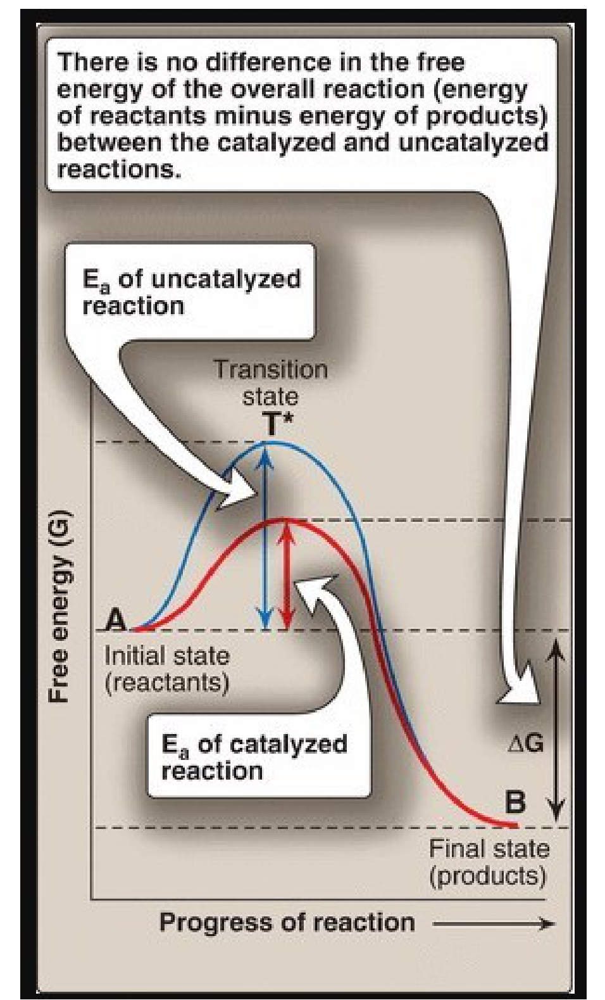

***Read this diagram vertically, in two separate places.** On the left, two different peak heights: the blue curve is the uncatalyzed barrier, the red the catalyzed one, and the enzyme's entire contribution is the difference between them. On the right, one shared drop: both curves start at the same reactant level and finish at the same product level, so the vertical distance between those two dashed lines — ΔG — is identical whether the enzyme is present or not. Any exam figure of this kind is asking you to distinguish a *peak-to-start* arrow from a *start-to-finish* arrow.*


> **★ MUST KNOW —** An enzyme lowers the **activation energy** and nothing else. It does not change **ΔG**, **ΔG°′**, the **equilibrium constant**, or the position of equilibrium — it changes only **how fast equilibrium is reached**, accelerating the forward and reverse directions equally.

### The six classes of enzymes

Every enzyme carries an **EC number** whose first digit is one of six reaction types. The numbering is fixed and is examined in that order, so learn the sequence, not just the six words.

**The six enzyme classes, in EC order**

| EC | Class | Reaction catalyzed | Example |
|----|----|----|----|
| **1** | **Oxidoreductase** | Oxidation–reduction: one substrate is oxidized, another reduced | Lactate dehydrogenase |
| ★ **2** | **Transferase** | Transfer of a functional group — C-, N- or P-containing — from one molecule to another. **Every kinase is a transferase**: it moves the phosphoryl group of ATP itself, which is not the same as using ATP as an energy source | **Hexokinase**; serine hydroxymethyltransferase |
| **3** | **Hydrolase** | Cleavage of a bond **by adding water** | Urease |
| **4** | **Lyase** | Cleavage of C–C, C–S or C–N bonds **without water**, often leaving a double bond | Pyruvate decarboxylase |
| **5** | **Isomerase** | Rearrangement of atoms within one molecule to give an isomer | Methylmalonyl-CoA mutase |
| **6** | **Ligase** | Joins two molecules into one, **paid for by hydrolysis of a high-energy phosphate** | Pyruvate carboxylase |

### Enzymes as markers of tissue damage

Enzymes are concentrated inside cells and have no job in plasma. The small amounts normally there arrive from ordinary cell turnover, with release balancing clearance, so levels sit inside a narrow reference range. Infection, toxins, poisons or trauma breach the membrane and spill the contents, and the degree of elevation tracks the extent of the damage. What limits the method is **specificity**: an enzyme found in many tissues tells you something was injured but not what.

**Serum enzymes in routine diagnostic use**

| Enzyme | Principal diagnostic use |
|----|----|
| **Alanine aminotransferase (ALT / SGPT)** | Liver. Abundant in and **most specific to** hepatocytes; part of the liver function panel — viral hepatitis, toxic hepatic injury |
| **Aspartate aminotransferase (AST / SGOT)** | Liver, heart, skeletal muscle — a wide distribution, so **less specific** than ALT |
| **Amylase** · **Lipase** | Acute pancreatitis |
| **Creatine kinase (CK)** | Muscle disorders and myocardial infarction |
| **Lactate dehydrogenase (LDH)** | Myocardial infarction; also hepatic injury |
| **γ-Glutamyl transpeptidase (GGT)** | Various liver diseases |
| **Ceruloplasmin** | Wilson disease (hepatolenticular degeneration) |
| **Acid phosphatase** | Metastatic carcinoma of the prostate |
| **Alkaline phosphatase** | Bone disorders; obstructive liver disease |

> **CLINICAL — READING A LIVER PANEL —** A rise in **ALT together with bilirubin** indicates **hepatocellular jaundice**: hepatocytes are being destroyed and the surviving liver can no longer clear bilirubin. **Mushroom poisoning** produces exactly this pattern.

### Isoenzymes

**Isoenzymes** (isozymes) are physically distinct forms of an enzyme that catalyze the same reaction. Their amino acid sequences differ, so they carry different numbers of charged residues and can be pulled apart by **electrophoresis** — all of them net negative, so all migrate toward the **anode (+)**, just at different speeds. Because organs contain characteristic proportions of each form, the pattern in serum localizes the damage rather than merely reporting it.

**The two isoenzyme families to know**

| Isoenzyme | Subunits | Predominant tissue |
|----|----|----|
| **CK-1** | BB | Brain |
| **CK-2** | **MB** | **Cardiac muscle** — the only tissue carrying more than 5% of its total CK as MB, which is what makes a rise in the MB fraction over total CK virtually specific for myocardial infarction |
| **CK-3** | MM | Skeletal muscle |
| **LDH-1** | HHHH | **Heart** |
| **LDH-2** | HHHM | The predominant form in **normal** serum |
| **LDH-3** | HHMM | — |
| **LDH-4** | HMMM | — |
| **LDH-5** | MMMM | **Liver** — rises in acute hepatitis |

Normal serum runs **LDH-2 \> LDH-1**. Myocardial infarction **flips** that order to **LDH-1 \> LDH-2**, and the flip, not the absolute value, is the finding. One artefact ruins the test: red cells are full of LDH, so a haemolysed sample reads falsely high and blood must be handled gently.


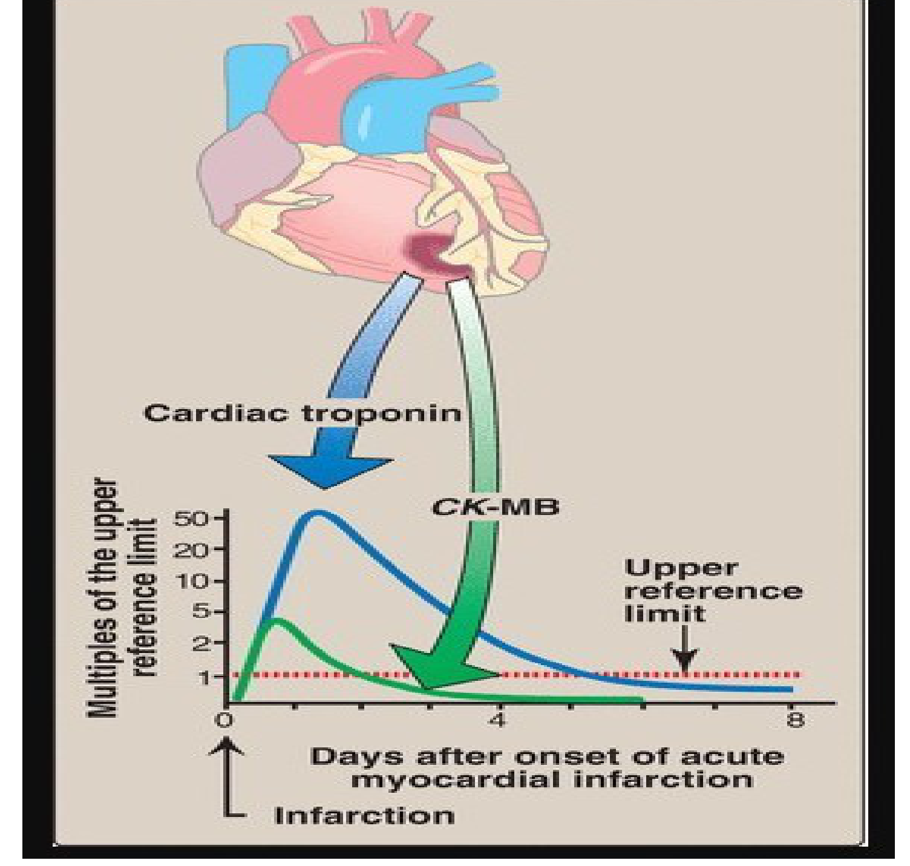

*★ **Two markers, two different windows.** The vertical axis is multiples of the upper reference limit, so the dotted line at 1 is the threshold for abnormality. **CK-MB** crosses it at **4–8 hours**, peaks near **24 hours**, and is back to baseline by **48–72 hours** — a narrow window that closes early. **Cardiac troponin T and I** cross at **4–6 hours**, peak at **8–28 hours**, and stay elevated for **3–10 days**. Troponin is both more sensitive and more specific and has superseded CK-MB and the LDH flip as the standard, but the short CK-MB tail is still what identifies a *second* infarct in a patient whose troponin has not yet come down.*


## Objective 2 · Michaelis-Menten kinetics; K m and V max

### The model

The accepted account of catalysis is the Michaelis-Menten model: enzyme and substrate combine reversibly into an **ES complex**, which then breaks down to free enzyme and product.

```text
E + S   ⇌   ES   ──▶   E + P       k₁ forward · k₂ reverse · k₃ catalytic
v = k₃[ES]             Km = (k₂ + k₃) / k₁
```

Velocity is directly proportional to \[ES\], so anything that raises or lowers the amount of ES changes the rate. K<sub>m</sub> is the ratio of **breakdown of ES over formation of ES**, which is where its inverse relationship with affinity comes from: an enzyme losing substrate faster than it captures it needs more substrate around to stay occupied.

Three assumptions make the model work. Substrate is in **large excess over enzyme**, so only a small fraction of it is bound at any time. The system is at **steady state** — ES is formed as fast as it breaks down, so \[ES\] does not change with time. And measurements are taken as **initial velocities (v<sub>o</sub>)**, the instant enzyme and substrate are mixed, when almost no product exists: the reverse reaction can be ignored and there is no product inhibition.

> **★ MUST KNOW —** The Michaelis-Menten equation:  **v<sub>o</sub> = V<sub>max</sub>\[S\] / (K<sub>m</sub> + \[S\])**

### What the two parameters mean

> **★ MUST KNOW · VS — K m vs V max — one is a concentration, the other a rate**
>
> **Km— the Michaelis constant —** The **substrate concentration at which v = ½V<sub>max</sub>**. It is measured in units of concentration (mM).
>
> **Vmax— the maximal velocity —** The velocity reached when **every active site is occupied** — saturation. Measured as product formed per unit time.
>
> Measures the enzyme's **affinity** for that substrate, and does so **inversely**: **low K<sub>m</sub> = high affinity**, **high K<sub>m</sub> = low affinity**. A low K<sub>m</sub> means very little substrate suffices to half-saturate the enzyme.
>
> Measures **catalytic capacity**: V<sub>max</sub> = k<sub>cat</sub> × \[E<sub>t</sub>\].
>
> **Does not vary** with enzyme concentration. It is a constant of one enzyme with one substrate, and reflects that enzyme's natural substrate.
>
> **Directly proportional** to enzyme concentration — halve the enzyme and V<sub>max</sub> halves. It is the only one of the two that the amount of enzyme can move.

### Getting the numbers off a graph

A Michaelis-Menten plot approaches V<sub>max</sub> asymptotically, so the curve never visibly arrives and neither parameter can be read off it accurately. Plotting the **reciprocals**, 1/v<sub>o</sub> against 1/\[S\], straightens the curve into a line that can be extrapolated back — the **Lineweaver-Burk** or **double-reciprocal** plot. The price is that reciprocals magnify error: a small experimental error, especially at low \[S\] where 1/\[S\] is large, becomes a large error in the K<sub>m</sub> and V<sub>max</sub> you calculate.


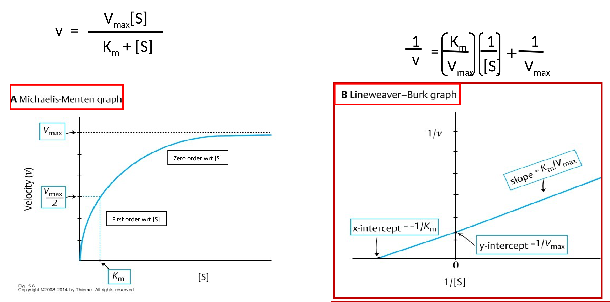

*★ **The same data, twice.** On the left the hyperbola: v rises steeply, then flattens as the enzyme saturates. On the right its double-reciprocal transform, and the three quantities you extract from it — **y-intercept = 1/V<sub>max</sub>**, **x-intercept = −1/K<sub>m</sub>**, **slope = K<sub>m</sub>/V<sub>max</sub>**. Both intercepts are reciprocals, so a *larger* intercept always means a *smaller* parameter, and an x-intercept moving toward zero from the left means K<sub>m</sub> is rising. Given a y-intercept of 0.02 min·µM⁻¹, V<sub>max</sub> is 50 µM/min; given an x-intercept at −0.2 mM⁻¹, K<sub>m</sub> is 5 mM.*


### The other kinetic parameters

| Parameter | Definition |
|----|----|
| **k<sub>cat</sub>** — the turnover number | Moles of product formed **per second per mole of catalytic centre**. A property of the enzyme molecule itself, independent of how much of it is present |
| **Unit of enzyme activity** | The amount of enzyme producing a stated quantity of product per unit time, e.g. **µmol product/min** |
| **Specific activity** | **Units per mg of protein**. Because enzymes are protein, this rises as a preparation is purified and is used as a measure of **purity** |

## Objective 3 · Factors that affect enzyme activity

Five things change the velocity of an enzyme-catalyzed reaction. Each has a characteristic plot, and recognizing the plot shape is usually the whole question — check the axes first, then the shape, then what moved.

**The five factors and the shape each produces**

| Factor | Shape of the v plot | What is happening |
|----|----|----|
| **Substrate concentration** | **Hyperbolic** | Velocity climbs with \[S\] until every binding site is occupied; the plateau is saturation |
| **Enzyme concentration** | **Straight line through the origin** | No plateau, because with substrate unlimited nothing caps the enzyme. This is the property exploited to measure how much of an enzyme is present in plasma, serum or tissue |
| **Temperature** | **Bell curve** | Rises as more molecules clear the energy barrier, peaks at the optimum, then collapses as heat denatures the protein |
| **pH** | **Bell curve** | Shifts the ionic charge on the side chains that bind substrate and perform catalysis; extremes of pH denature the enzyme outright |
| **Activators and inhibitors** | Curve shifts position | Objectives 4 and 5 |

### Substrate concentration: the order of the reaction

Where an enzyme sits on its hyperbola relative to K<sub>m</sub> decides whether its rate tracks substrate supply or ignores it — and physiologically that is a design choice, made differently in different tissues.

> **★ MUST KNOW · VS — First-order vs zero-order kinetics**
>
> **First order with respect to \[S\] —** Holds when **\[S\] ≪ K<sub>m</sub>**, the steep early part of the curve.
>
> **Zero order with respect to \[S\] —** Holds when **\[S\] ≫ K<sub>m</sub>**, the plateau.
>
> K<sub>m</sub> + \[S\] ≈ K<sub>m</sub>, so the equation reduces to **v = V<sub>max</sub>\[S\]/K<sub>m</sub>**.
>
> K<sub>m</sub> + \[S\] ≈ \[S\], so \[S\] cancels and the equation reduces to **v = V<sub>max</sub>**.
>
> Velocity is **proportional** to substrate concentration — supply more substrate and the rate rises with it.
>
> Velocity is **independent** of substrate concentration — the enzyme is saturated and more substrate achieves nothing.
>
> The transporter parallel: **GLUT2**, in **liver and pancreas**, moves glucose in proportion to how much is there.
>
> The transporter parallel: **GLUT1 and GLUT3**, in **brain and red cells**, move glucose at a constant rate whatever the blood level.

Between the two regions, around \[S\] ≈ K<sub>m</sub>, the reaction is **mixed order**: neither approximation applies and the velocity is partly but not fully responsive to substrate.

### Two kinases, two different K m values, two different jobs

Both enzymes catalyze the identical reaction — glucose + ATP → glucose-6-phosphate + ADP — which traps glucose inside the cell by putting a charge on it and commits it to metabolism. They differ only in their kinetic constants, and that difference is enough to give the liver and the brain opposite behaviour on the same blood glucose.

> **★ MUST KNOW · VS — Hexokinase vs glucokinase**
>
> **Hexokinase — the high-affinityenzyme —** **Low K<sub>m</sub> (≈0.05 mM)** and **low V<sub>max</sub>**. Present in **most tissues**, notably **brain and red cells**, which are supplied by **GLUT1 and GLUT3**.
>
> **Glucokinase — the high-capacityenzyme —** **High K<sub>m</sub> (≈10 mM)** and **high V<sub>max</sub>**. Present in the **liver** and the **islet cells of the pancreas**, supplied by **GLUT2**.
>
> The low K<sub>m</sub> lets it capture glucose efficiently **even when blood glucose is low**, which is what keeps brain and red cells — tissues that can never be without glucose — supplied during fasting. The low V<sub>max</sub> caps how much it can phosphorylate.
>
> The high V<sub>max</sub> lets it phosphorylate glucose **in bulk after a meal**, when portal glucose is high, which is what the liver needs as the chief site of metabolism.


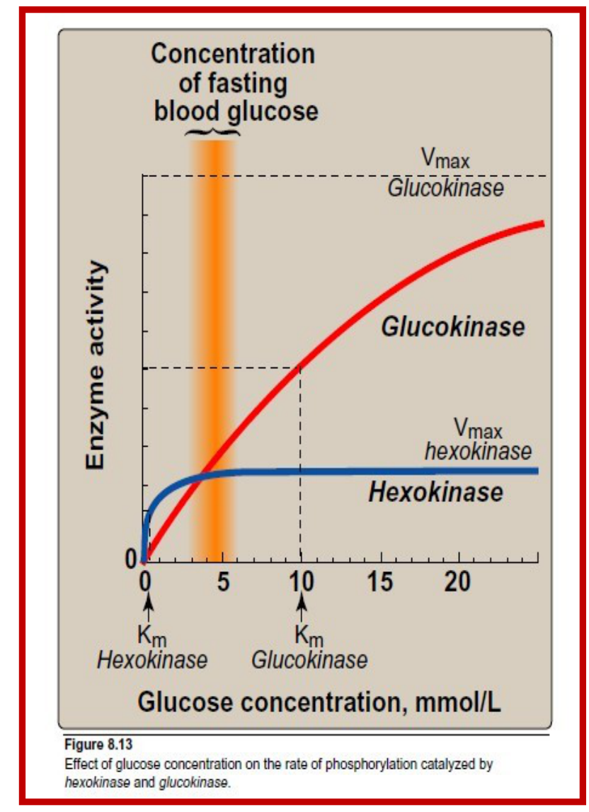

***The shaded band is the whole point.** It marks the fasting blood glucose range. Trace it upward: it crosses the hexokinase curve out on its plateau, where the enzyme is already running flat out, and crosses the glucokinase curve on its steep rising limb, well short of half-saturation. The same blood glucose therefore reads as "saturated" to one enzyme and "barely started" to the other. Note also the two plateaus: the glucokinase curve keeps climbing past where hexokinase has stopped.*


> **★ MUST KNOW —** Glucokinase is the **glucose sensor** of the pancreatic islet cells, setting the **threshold for insulin secretion**. Its K<sub>m</sub> sits deliberately **above** the normal circulating glucose concentration of ≈5 mM — which is what allows the liver to release glucose into the blood instead of trapping all of it.

### Temperature and pH

Both give bell curves because both destroy the enzyme at their extremes. Most human enzymes are optimal at **35–40 °C** and begin to denature above 40 °C; the exception is the **thermostable DNA polymerases** used in PCR, from hot-spring organisms, with optima near 70 °C. pH works by changing the ionization of amino acid side chains, so a group that must be protonated is deprotonated as pH rises and activity falls away. Most human enzymes are optimal near **pH 7.4**, but an enzyme's optimum generally matches the compartment it works in.

**pH optima worth knowing**

| Enzyme | Optimum pH | Where it works |
|----|----|----|
| **Pepsin** | **1–2** | Stomach lumen |
| **Acid phosphatase** | **4–5** | Lysosome, prostate |
| **Trypsin** | **5–7** | Small intestine (its true peak lies at the alkaline end of that range) |
| **Alkaline phosphatase** | **9–10** | Bone, biliary epithelium |

## Objective 4 · Competitive, noncompetitive and suicide inhibition

An **inhibitor** is any compound that lowers the velocity of an enzyme-catalyzed reaction by binding **to the enzyme** — never to the substrate and never to the product. One structural fact sorts them: **reversible** inhibitors attach **non-covalently**, **irreversible** inhibitors attach **covalently**.

### What each inhibitor is actually doing

> **VS — Competitive vs noncompetitive — the two mechanistic tells**
>
> **Competitive —** The inhibitor is a **structural analog** of the substrate. Because both need the same site, an **ESI complex never forms** — the enzyme has bound S or I, and the two states are mutually exclusive.
>
> **Noncompetitive —** The inhibitor has **no** structural resemblance to the substrate. It has its own site, so an **ESI complex does form** — substrate and inhibitor sit on the enzyme together, and no product comes out.

Because a **competitive** inhibitor and the substrate contest a single site, which of the two an enzyme molecule is holding comes down to relative numbers. Enough substrate always wins that contest back and the reaction can still reach its original ceiling; what the inhibitor costs is the amount of substrate needed to get halfway there.

A **noncompetitive** inhibitor does not interfere with substrate binding at all, so the enzyme's grip on substrate is exactly what it always was. What falls is the number of enzyme molecules able to complete a catalytic cycle, and flooding the system with substrate cannot revive them.

An **irreversible** inhibitor forms a covalent bond at the active site, permanently subtracting that molecule from the pool of active enzyme, \[E<sub>t</sub>\]. A **suicide inhibitor** is the refined case: the enzyme itself converts the compound into the reactive species that then destroys it. Since the ceiling velocity depends on how much enzyme is present, losing enzyme lowers the ceiling — while the survivors are ordinary enzyme with an ordinary grip on substrate. A question has to tell you the bond is covalent, because the kinetics will not.

> **VS — Noncompetitive vs irreversible (suicide) — what happens to the enzyme molecule**
>
> **Noncompetitive —** The enzyme molecule is **occupied** but structurally intact. Remove or dilute the inhibitor and full activity returns; \[E<sub>t</sub>\] never actually changed.
>
> **Irreversible / suicide —** The enzyme molecule is **destroyed**. \[E<sub>t</sub>\] falls permanently and activity can only be restored by synthesizing new enzyme.

The three differ along four dimensions, and a question will hand you one and expect the other three. The last column is what an exam is most likely to show you instead of state.

**Competitive, noncompetitive and suicide inhibition compared**

| Type | Binds at | K<sub>m</sub> (apparent) | V<sub>max</sub> (apparent) | Overcome by ↑\[S\]? | Lineweaver-Burk signature |
|----|----|----|----|----|----|
| ★ **Competitive** | **Active site** | **Increased** | **Unchanged** | **Yes** | Lines **share the y-intercept** (1/V<sub>max</sub>); the x-intercept moves toward zero |
| ★ **Noncompetitive** | **Another site** | **Unchanged** | **Decreased** | **No** | Lines **share the x-intercept** (−1/K<sub>m</sub>); the y-intercept rises |
| ★ **Irreversible / suicide** | **Active site**, covalently | **Unchanged** | **Decreased** | **No** — the bond is covalent | **Identical to noncompetitive** |

Whichever type is in play, the inhibited line on a Lineweaver-Burk plot always lies **above** the control line, because every inhibitor lowers v and therefore raises 1/v.


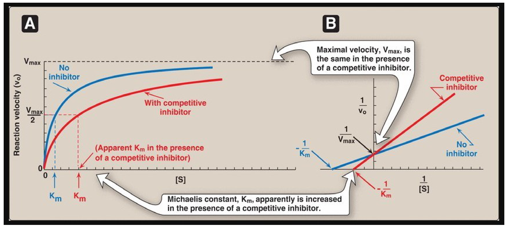

***Competitive inhibition, in both plots.** On the hyperbola (A) the inhibited red curve eventually catches the blue one at the top — the point being that it *does* catch it, given enough substrate — but reaches half-height further to the right. On the double-reciprocal plot (B) the two lines meet on the vertical axis: a shared y-intercept is the visual signature, and the steeper the line, the more inhibitor was present.*


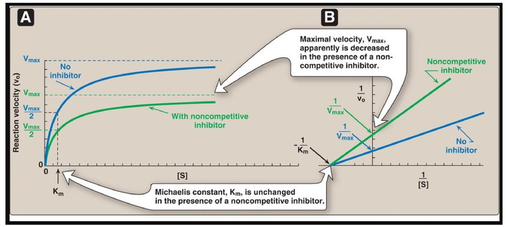

***Noncompetitive inhibition, in both plots.** On the hyperbola (A) the green curve plateaus lower and never converges with the blue one no matter how far right you go — but note it reaches *its own* half-height at the same place on the x-axis. On the double-reciprocal plot (B) the lines meet on the horizontal axis. Whenever two Lineweaver-Burk lines cross to the left of the vertical axis rather than on it, the parameter held constant is K<sub>m</sub>.*


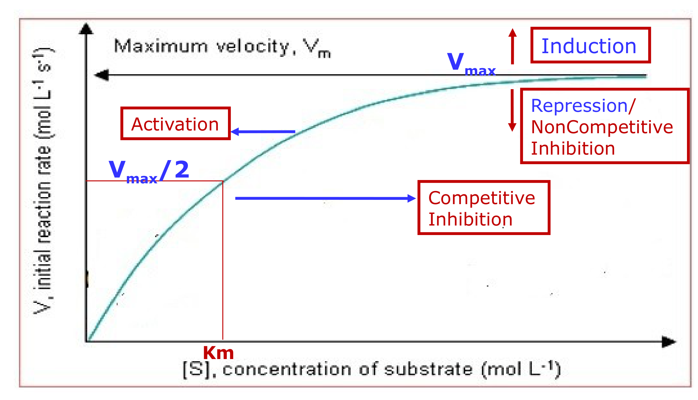

*★ **Four directions, four causes — the single most useful graph in this lecture.** **Up** = V<sub>max</sub> rises = **induction**, more enzyme made. **Down** = V<sub>max</sub> falls = **repression** or **noncompetitive / irreversible inhibition**, which is why those two cannot be distinguished from the curve alone. **Right** = K<sub>m</sub> rises = **competitive inhibition**, since higher K<sub>m</sub> means lower affinity. **Left** = K<sub>m</sub> falls = **activation**. Work vertically for V<sub>max</sub> and horizontally for K<sub>m</sub> and the four cases separate immediately.*


### The drugs and poisons that work this way

**Inhibitors in clinical use, by mechanism**

| Mechanism | Agent | Target enzyme | Consequence |
|----|----|----|----|
| **Competitive** | **Statins** — lovastatin, simvastatin, pravastatin | **HMG-CoA reductase**, the rate-limiting enzyme of cholesterol biosynthesis | Blocks hepatic cholesterol synthesis and lowers plasma cholesterol. The statin skeleton is a structural analog of HMG-CoA |
| **Competitive** | **Methotrexate (MTX)** | **Dihydrofolate reductase (DHFR)**, which reduces dihydrofolate to **tetrahydrofolate (THF)** | Starves the cell of THF, which is needed for cell division — hence its use in **chemotherapy** and in **rheumatoid arthritis**. MTX is a close structural analog of folate |
| **Noncompetitive** | **Physostigmine** | **Acetylcholinesterase** | Acetylcholine is not degraded, so cholinergic neurotransmission is prolonged |
| **Irreversible** | **Aspirin** | **Cyclooxygenase-1 and -2**, covalently acetylated | Prostaglandin synthesis stops — the analgesic and anti-inflammatory effect |
| **Irreversible** | **Disulfiram** (Antabuse) | **Acetaldehyde dehydrogenase** | Acetaldehyde accumulates after a drink and the patient feels acutely ill — a learned aversion used in the treatment of chronic alcoholism |
| **Irreversible** | **Cyanide** · **nerve gas** · **organophosphates** | Various | The poison end of the same mechanism |

## Objective 5 · Allosteric modulation of enzyme activity

### Why allosteric enzymes need their own rules

An **allosteric enzyme** is **multimeric** — built from several subunits — and carries a **regulatory site distinct from the catalytic site**, sometimes on a subunit that does no catalysis at all. A small molecule binding there produces a conformational change transmitted through the bulk of the protein to the active sites. Because the subunits are coupled, the first molecule to bind makes it easier for the next, so the response builds gradually. That cooperativity bends the velocity curve into an S, and is the same behaviour hemoglobin shows in binding oxygen. Allosteric enzymes **frequently catalyze the committed step** of a pathway, early and at a branch point — precisely where a cell would want a control knob.

> **★ MUST KNOW · VS — Michaelis-Menten enzyme vs allosteric enzyme**
>
> **Michaelis-Menten (non-allosteric) —** Plot of v against \[S\] is **hyperbolic**. Active sites act independently.
>
> **Allosteric —** Plot of v against \[S\] is **sigmoidal**. Subunits cooperate, so binding at one site alters the others.
>
> Half-saturation is described by **K<sub>m</sub>**.
>
> **Has no K<sub>m</sub>**. The half-saturation point is reported as **K<sub>0.5</sub>** or **S<sub>0.5</sub>**, because the sigmoid does not obey the Michaelis-Menten equation.

### Effectors, and the two things they can change

The small regulatory molecules that bind allosteric enzymes are **allosteric effectors** or **modulators**. They bind **non-covalently** and away from the catalytic site, and they come in both signs: **positive effectors (activators)** raise activity, **negative effectors (inhibitors)** lower it. When the effector is the enzyme's own substrate the effect is called **homotropic** — that is the cooperativity above; when it is some other molecule it is **heterotropic**, the case in feedback inhibition, where the end product of a pathway shuts down an enzyme several steps upstream.

> **★ MUST KNOW · VS — K-type vs V-type modulators**
>
> **K-type —** Alters the enzyme's **affinity** for substrate — K<sub>0.5</sub> moves left (activator) or right (inhibitor). V<sub>max</sub> is unchanged.
>
> **V-type —** Alters the enzyme's **catalytic activity** — V<sub>max</sub> moves up (activator) or down (inhibitor). K<sub>0.5</sub> is unchanged.


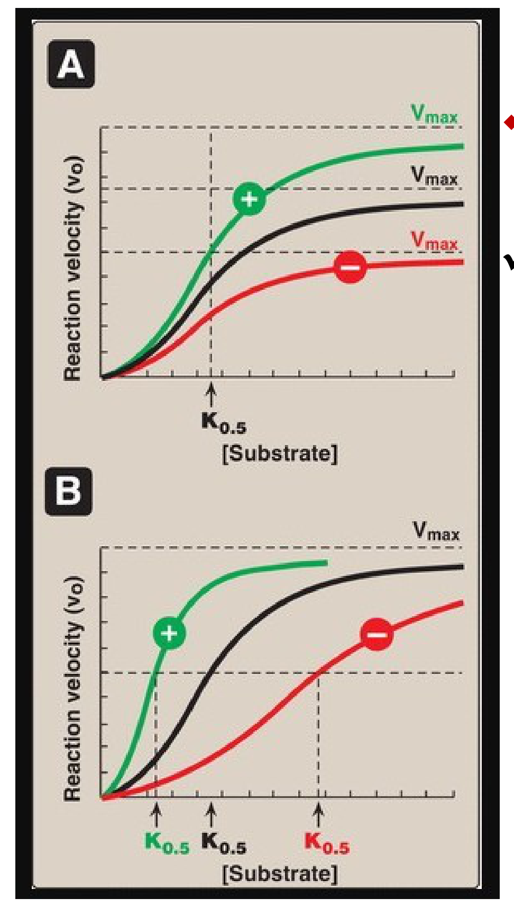

***Which axis moved?** In panel A the three curves plateau at three different heights but all reach half-height above the same point on the x-axis — the effector changed V<sub>max</sub>. In panel B they plateau together but the three K<sub>0.5</sub> marks are spread along the x-axis — the effector changed affinity. Green circles mark the positive effector, red the negative. Applying the same test to a sigmoid curve you are shown is how you decide between the two.*


### Allosteric regulation of glycogen metabolism

| Enzyme | Positive effectors | Negative effectors |
|----|----|----|
| **Glycogen phosphorylase** · glycogen → glucose-1-phosphate | **AMP**, **Ca²⁺** (muscle) | **ATP**, **glucose**, **glucose-6-phosphate** |
| **Glycogen synthase** · glucose-1-phosphate → glycogen | **Glucose-6-phosphate** | — |

The signs above are deducible rather than memorizable, and the same logic works on every pathway you will meet. Read what the pathway is *for*: muscle degrades glycogen to make ATP, so a signal that ATP is short, or that the muscle is contracting, switches degradation on, and ATP itself switches it off. Then read the traffic: a pathway's entry molecule activates the enzyme that consumes it, and its products inhibit the enzyme that made them.

Allosteric regulation is one of the **short-term** mechanisms — with substrate concentration, product inhibition, proenzyme activation and reversible covalent modification — which act on enzyme molecules that already exist. **Long-term** regulation changes enzyme quantity instead, by induction, repression or degradation through the ubiquitin–proteasome and lysosomal pathways; **compartmentalization** changes enzyme location. All are developed in Lecture 01.

## Part 6 · Self-test

Cover the answers. Say each one out loud before you look — the goal is recall, not recognition.

1.  Define enzyme, substrate and product; name the one class of biological catalyst that is not protein; and say by what factor enzymes accelerate reactions and what two things besides speed they provide. **Answer:** A biocatalyst that speeds a reaction without itself being changed, converting substrate into product per unit time. Substrate = the molecule transformed, product = the result. Ribozymes are catalytic RNA — the exception to "enzymes are protein." Acceleration is 10³–10⁸-fold; enzymes also supply specificity and a point of regulatory control.
2.  What is the active site, and what does "induced fit" add to the older lock-and-key picture? **Answer:** A pocket formed by protein folding, lined with side chains that bind substrate and carry out catalysis. Induced fit says binding is not passive: substrate triggers a conformational change that closes the site around it and aligns the catalytic groups.
3.  Define apoenzyme, holoenzyme, cofactor and coenzyme; say which one is inactive; and name two metalloenzymes with their metals. **Answer:** Apoenzyme = the protein part alone, and the inactive one. Holoenzyme = apoenzyme + non-protein part, catalytically active. Cofactor = inorganic, a metal ion. Coenzyme = organic, usually vitamin-derived. Carbonic anhydrase requires Zn²⁺; lysyl oxidase requires Cu²⁺, and both it and the copper are essential for collagen processing.
4.  NAD⁺ vs FAD: which is a cosubstrate and which a prosthetic group, what is the criterion, and which vitamin does each come from? **Answer:** NAD⁺ is a cosubstrate — it associates transiently and dissociates in an altered state; from niacin (B₃). FAD is a prosthetic group — permanently associated, returned to its original state on the enzyme; from riboflavin (B₂). Coenzyme A is another cosubstrate, biotin another prosthetic group.
5.  Define the free energy of activation, explain why lowering it makes a reaction faster, and say what happens to ΔG, ΔG°′ and K<sub>eq</sub>. **Answer:** The energy difference between reactants and the high-energy transition-state intermediate. Only molecules carrying that much energy can react, so lowering the barrier qualifies a far larger fraction and the rate rises. ΔG, ΔG°′ and K<sub>eq</sub> are untouched — the enzyme accelerates forward and reverse equally and changes only the rate at which equilibrium is reached, never its position.
6.  In the diagram below, which arrow represents the change in free energy for the catalyzed conversion S → P? **Answer:** **E** — the only arrow spanning the S ground state to the P ground state. All the others run from a ground state up to a transition-state peak and are therefore activation energies, not ΔG. E would be exactly the same arrow for the uncatalyzed reaction.
    

    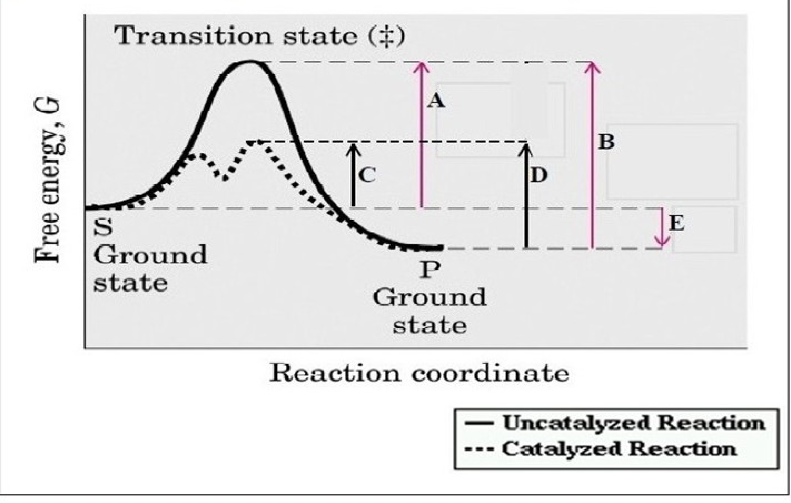

    
7.  Name the six enzyme classes in EC order, and distinguish a hydrolase from a lyase with an example of each. **Answer:** 1 oxidoreductase, 2 transferase, 3 hydrolase, 4 lyase, 5 isomerase, 6 ligase. A hydrolase cleaves a bond by adding water (urease); a lyase cleaves C–C, C–S or C–N bonds without water, often generating a double bond (pyruvate decarboxylase).
8.  Hexokinase catalyzes glucose + ATP → glucose-6-phosphate + ADP. Which EC class, and why is it not a ligase? **Answer:** **Transferase** (class 2). A ligase joins two molecules into one and pays for it by hydrolyzing a high-energy phosphate; a kinase transfers the phosphoryl group of ATP itself, which is a group transfer. The presence of ATP in a reaction does not make an enzyme a ligase.
9.  Where do the enzymes measured in serum come from in a healthy person, what does an elevated level mean, and which is more liver-specific — ALT or AST? **Answer:** Normal cell turnover, with release balanced by clearance, so levels are stable. A rise above the reference range means tissue damage, and the degree of elevation tracks its extent. ALT is more liver-specific, being concentrated in hepatocytes, whereas AST is also in heart and skeletal muscle. ALT rising with bilirubin = hepatocellular jaundice, the picture in mushroom poisoning.
10. Match to the enzyme: acute pancreatitis; Wilson disease; metastatic prostate carcinoma; obstructive liver disease. **Answer:** Amylase and lipase; ceruloplasmin; acid phosphatase; alkaline phosphatase (also bone disorders).
11. Define an isoenzyme, say why electrophoresis separates them and toward which electrode they migrate, and give the subunits and tissue for CK-1, CK-2 and CK-3. **Answer:** Physically distinct forms of an enzyme catalyzing the same reaction, differing in sequence and tissue distribution. Different sequences mean different numbers of charged residues, hence different mobility; all are net negative, so all migrate to the anode (+), at different rates. CK-1 = BB, brain; CK-2 = MB, cardiac muscle; CK-3 = MM, skeletal muscle. Myocardium is the only tissue with more than 5% of its CK as MB, which makes a rise in MB over total CK virtually specific for infarction.
12. A patient's serum shows LDH-1 \> LDH-2. What does that indicate, which LDH rises in liver injury, and what artefact must be excluded? **Answer:** Myocardial infarction — the normal pattern is LDH-2 \> LDH-1, and the flip is the finding. Liver injury raises LDH-5 (MMMM). Haemolysis releases LDH from red cells and falsely elevates the result, so samples must be handled carefully.
13. Give the time courses of CK-MB and cardiac troponin after an infarct, and say which is now standard and why. **Answer:** CK-MB: appears at 4–8 hours, peaks at ~24 hours, back to baseline by 48–72 hours. Troponin T or I: appears at 4–6 hours, peaks at 8–28 hours, stays elevated 3–10 days. Troponin is more sensitive and more specific and is now the standard, but CK-MB's short tail still helps detect re-infarction.
14. Write the Michaelis-Menten reaction model, say what velocity is proportional to, give the three assumptions behind the equation, and express K<sub>m</sub> in rate constants. **Answer:** E + S ⇌ ES → E + P, with v = k₃\[ES\] — velocity is proportional to \[ES\]. Assumptions: \[S\] ≫ \[E\]; steady state, so \[ES\] is constant in time; initial velocities only, so no product has accumulated and both the reverse reaction and product inhibition can be ignored. K<sub>m</sub> = (k₂ + k₃)/k₁ — breakdown over formation of ES, which is why a high K<sub>m</sub> means low affinity: the enzyme loses substrate faster than it captures it.
15. State the Michaelis-Menten equation and define K<sub>m</sub> from it. **Answer:** v<sub>o</sub> = V<sub>max</sub>\[S\]/(K<sub>m</sub> + \[S\]). K<sub>m</sub> is the substrate concentration at which v = ½V<sub>max</sub> — substitute \[S\] = K<sub>m</sub> and the equation gives v = V<sub>max</sub>/2.
16. Which parameter varies with enzyme concentration and which does not — and what is V<sub>max</sub> equal to? **Answer:** V<sub>max</sub> is directly proportional to \[E\]; halve the enzyme and V<sub>max</sub> halves. K<sub>m</sub> does not vary with \[E\] at all. V<sub>max</sub> = k<sub>cat</sub> × \[E<sub>t</sub>\].
17. Give the Lineweaver-Burk equation and its three readable features, and say why the transform is worth doing and what it costs. **Answer:** 1/v = (K<sub>m</sub>/V<sub>max</sub>)(1/\[S\]) + 1/V<sub>max</sub>; y-intercept = 1/V<sub>max</sub>, x-intercept = −1/K<sub>m</sub>, slope = K<sub>m</sub>/V<sub>max</sub>. Worth doing because the hyperbola approaches V<sub>max</sub> asymptotically and neither parameter reads off it accurately, whereas a straight line extrapolates. The cost: reciprocals magnify error, so a small measurement error becomes a large error in the constants.
18. A double-reciprocal plot has a y-intercept of 0.04 (min·µM⁻¹) and an x-intercept of −0.5 mM⁻¹. Give V<sub>max</sub> and K<sub>m</sub>. **Answer:** V<sub>max</sub> = 1/0.04 = **25 µM/min**. K<sub>m</sub> = −1/(−0.5) = **2 mM**. Both intercepts are reciprocals, so a bigger intercept means a smaller parameter.
19. Define k<sub>cat</sub> and specific activity, and say what each is used for. **Answer:** k<sub>cat</sub>, the turnover number, is moles of product per second per mole of catalytic centre — a property of the molecule regardless of how much is present. Specific activity is units per mg protein, a measure of purity. A unit is the amount of enzyme forming a stated quantity of product per unit time, e.g. µmol/min.
20. Name the five factors that affect enzyme activity and the plot shape each produces, and say why the enzyme-concentration plot is clinically useful. **Answer:** Substrate concentration — hyperbola. Enzyme concentration — straight line through the origin. Temperature — bell curve. pH — bell curve. Activators/inhibitors — the curve shifts. Because initial velocity is proportional to the amount of enzyme, measuring a rate tells you how much enzyme is in a plasma, serum or tissue sample — the basis of diagnostic enzyme assays.
21. What does the Michaelis-Menten equation reduce to when \[S\] ≪ K<sub>m</sub> and when \[S\] ≫ K<sub>m</sub>, what is each region called, and which glucose transporter goes with each? **Answer:** \[S\] ≪ K<sub>m</sub>: K<sub>m</sub> + \[S\] ≈ K<sub>m</sub>, so v = V<sub>max</sub>\[S\]/K<sub>m</sub> — velocity proportional to \[S\], **first order** — GLUT2, liver and pancreas. \[S\] ≫ K<sub>m</sub>: K<sub>m</sub> + \[S\] ≈ \[S\], so v = V<sub>max</sub> — velocity independent of \[S\], **zero order** — GLUT1 and GLUT3, brain and red cells. Around \[S\] ≈ K<sub>m</sub> the reaction is mixed order.
22. Hexokinase in red cells has a K<sub>m</sub> of 0.1 mM for glucose; plasma glucose is 5 mM. Which is true — it is at 50% of V<sub>max</sub>, 50% saturated, doubled by raising glucose to 10 mM, at 100% of V<sub>max</sub>, or slowed by dropping glucose to 3 mM? **Answer:** **It is operating at 100% of V<sub>max</sub>**. \[S\] is 50× K<sub>m</sub>, so the enzyme is saturated and in the zero-order region; changing glucose between 3 and 10 mM does nothing. No calculation needed — just compare \[S\] with K<sub>m</sub>. (Strictly v = 5/5.1 = 98% of V<sub>max</sub>; the intended reading is "effectively maximal.")
23. Contrast hexokinase and glucokinase on K<sub>m</sub>, V<sub>max</sub>, tissue and transporter, and give both K<sub>m</sub> values. **Answer:** Hexokinase: low K<sub>m</sub> ≈0.05 mM (high affinity), low V<sub>max</sub>, most tissues including brain and red cells, GLUT1/3. Glucokinase: high K<sub>m</sub> ≈10 mM (low affinity), high V<sub>max</sub>, liver and pancreatic islets, GLUT2.
24. Why must glucokinase have a K<sub>m</sub> above the normal blood glucose concentration, and what second job does that fit it for? **Answer:** Normal circulating glucose is ≈5 mM, below its K<sub>m</sub>, so the liver does not trap all the glucose passing through and can instead release glucose into the blood — one of its main functions. The same property makes glucokinase the glucose sensor of pancreatic islet cells, setting the threshold for insulin secretion, because its rate tracks blood glucose across the physiological range instead of being saturated by it.
25. Give the optimum temperature and pH for most human enzymes, one exception, and the pH optima of pepsin, acid phosphatase, trypsin and alkaline phosphatase. **Answer:** 35–40 °C and ≈7.4. The thermostable DNA polymerases used in PCR are the temperature exception, near 70 °C. Pepsin 1–2, acid phosphatase 4–5, trypsin 5–7, alkaline phosphatase 9–10. pH acts by changing side-chain ionization; extremes denature the enzyme.
26. What does an inhibitor bind to, and what single structural feature separates reversible from irreversible inhibition? **Answer:** The enzyme — never the substrate, never the product. Reversible inhibitors bind non-covalently; irreversible inhibitors bind covalently.
27. Give the effect of a competitive inhibitor on K<sub>m</sub> and V<sub>max</sub>, whether excess substrate rescues it and why, and say which inhibition type forms an ESI complex. **Answer:** K<sub>m</sub> increases, V<sub>max</sub> is unchanged, and yes: the inhibitor is a structural analog competing for the same active site, so enough substrate wins the contest and the original ceiling is still reachable — it just takes more substrate to reach half of it. Competitive inhibition **never** forms an ESI complex, since both molecules need the same site; noncompetitive does, and the complex makes no product.
28. A noncompetitive inhibitor of an enzyme does which of: increases K<sub>m</sub> with no change in V<sub>max</sub>; decreases both; decreases V<sub>max</sub>; increases V<sub>max</sub>; increases both? **Answer:** **Decreases V<sub>max</sub>**, with K<sub>m</sub> unchanged. "Increases K<sub>m</sub> with no change in V<sub>max</sub>" is competitive inhibition; any option raising V<sub>max</sub> is a throwaway, since no inhibitor increases V<sub>max</sub>.
29. Why is suicide inhibition kinetically identical to noncompetitive inhibition, and what tells them apart? **Answer:** Both reduce the number of enzyme molecules able to complete a cycle, so V<sub>max</sub> falls while the survivors bind substrate normally and K<sub>m</sub> is unchanged. Only the bond differs: covalent and permanent, lowering \[E<sub>t</sub>\], versus non-covalent and reversible on dilution with \[E<sub>t</sub>\] intact. The graph cannot tell you; the stem must.
30. Two Lineweaver-Burk lines intersect on the y-axis; a second pair intersects on the x-axis. Identify each and say which parameter changed. **Answer:** Shared y-intercept = competitive: 1/V<sub>max</sub> and therefore V<sub>max</sub> is unchanged, and the differing x-intercepts mean K<sub>m</sub> increased. Shared x-intercept = noncompetitive or irreversible/suicide: −1/K<sub>m</sub> and therefore K<sub>m</sub> is unchanged, and the differing y-intercepts mean V<sub>max</sub> decreased. Either way the inhibited line lies above the control line.
31. Methotrexate competitively inhibits dihydrofolate reductase. Rates were measured with 10 nM enzyme, dihydrofolate from 1–500 µM, and 0, 5 or 20 nM methotrexate. Which plot below is the expected outcome? **Answer:** **A.** Two things must be right. The axes: the varied substrate is dihydrofolate, so the x-axis must be 1/\[dihydrofolate\] — eliminating C and D, which plot against 1/\[methotrexate\]. Then the pattern: competitive inhibition gives a shared y-intercept with slope rising as inhibitor rises, so the 20 nM line is steepest. B reverses the order, making more inhibitor look less inhibitory.
    

    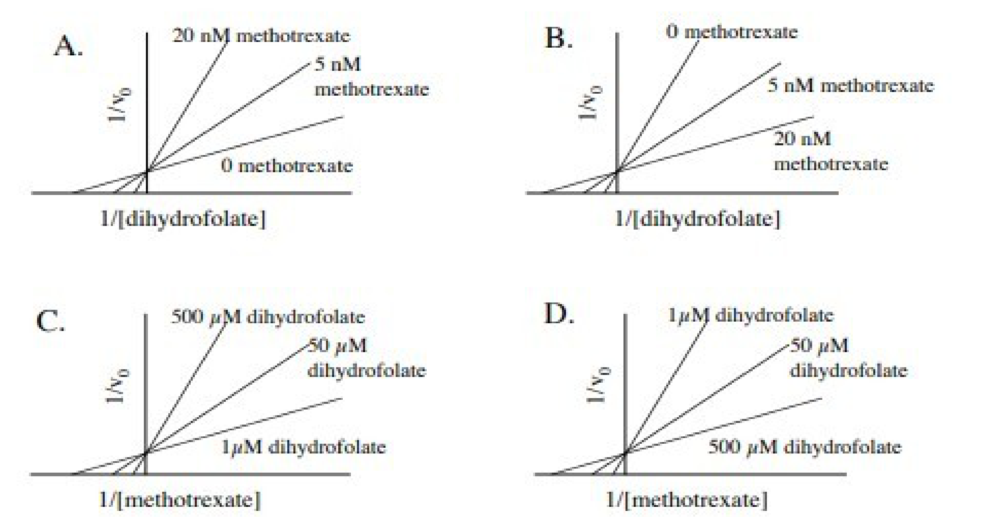

    
32. Give the target enzyme and mechanism class for statins, methotrexate, physostigmine, aspirin and disulfiram. **Answer:** Statins — HMG-CoA reductase, rate-limiting for cholesterol synthesis; competitive; lowers plasma cholesterol. Methotrexate — dihydrofolate reductase; competitive; starves the cell of THF needed for cell division, hence chemotherapy and rheumatoid arthritis. Physostigmine — acetylcholinesterase; noncompetitive. Aspirin — COX-1 and -2; irreversible, blocking prostaglandin synthesis. Disulfiram — acetaldehyde dehydrogenase; irreversible, so acetaldehyde accumulates after alcohol. Cyanide, nerve gas and organophosphates are the poison end of the same mechanism.
33. A velocity curve shifts right; a second shifts down. Name the cause of each, and say why one of them is ambiguous. **Answer:** Right = K<sub>m</sub> increased = competitive inhibition (higher K<sub>m</sub>, lower affinity). Down = V<sub>max</sub> decreased = either repression, which makes less enzyme, or noncompetitive/irreversible inhibition, which disables existing enzyme. Both reduce the number of functioning molecules, so the curve alone cannot separate them. A left shift is activation, an upward shift is induction.
34. An enzyme's v versus \[S\] curve is sigmoidal. What can you immediately say about it? **Answer:** It is allosteric: multimeric, cooperative between subunits, does not obey Michaelis-Menten kinetics, has no K<sub>m</sub> — use K<sub>0.5</sub> or S<sub>0.5</sub> — and frequently catalyzes the committed step of its pathway.
35. Where does an allosteric effector bind, what does binding do, what is the difference between a homotropic and a heterotropic effector, and between a K-type and a V-type modulator? **Answer:** Non-covalently, at a regulatory site distinct from the catalytic site, sometimes on a non-catalytic subunit; binding causes a conformational change transmitted through the protein to the active sites. Homotropic: the effector is the substrate itself — that is cooperativity. Heterotropic: a different molecule, as in end-product feedback inhibition. K-type changes affinity — K<sub>0.5</sub> moves, V<sub>max</sub> stays. V-type changes catalytic activity — V<sub>max</sub> moves, K<sub>0.5</sub> stays. Either can be positive or negative.
36. CTP was added to aspartate transcarbamoylase and the rate measured against aspartate, giving the curves below. Which is correct — CTP decreases V<sub>max</sub>; CTP increases the K<sub>M</sub>; CTP is a negative allosteric effector; CTP is a positive allosteric effector; CTP has no effect? **Answer:** **CTP acts as a negative allosteric effector.** The curve is displaced right and downward, so activity falls at every aspartate concentration. "Decreases V<sub>max</sub>" is wrong because both curves are still climbing toward the same plateau. "Increases the K<sub>M</sub>" is the trap: the curve is sigmoidal, so this enzyme has no K<sub>m</sub> at all — the shift is in K<sub>0.5</sub>, making CTP a K-type negative effector.
    

    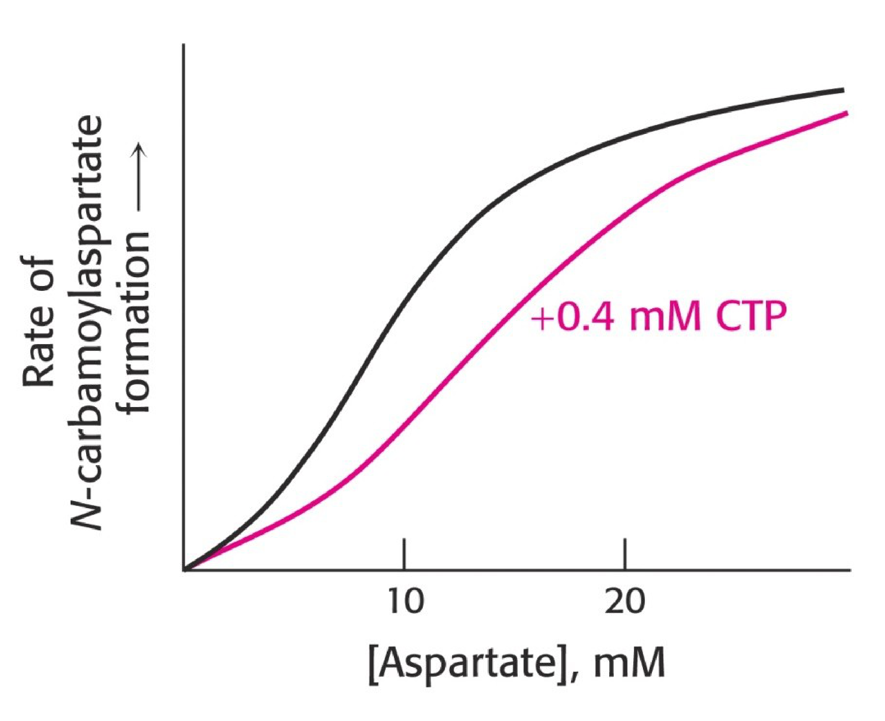

    
37. Give the positive and negative allosteric effectors of glycogen phosphorylase and glycogen synthase, and the reasoning that generates them. **Answer:** Phosphorylase: positive AMP and Ca²⁺ in muscle; negative ATP, glucose and glucose-6-phosphate. Synthase: positive glucose-6-phosphate. The reasoning is the pathway's purpose — muscle breaks glycogen down to make ATP, so a signal that ATP is short (AMP) or that the muscle is contracting (Ca²⁺) turns it on and ATP turns it off; G6P is the entry molecule for synthesis, so it turns synthesis on.
38. Which regulatory mechanisms act on enzyme molecules that already exist, and which change how many there are? **Answer:** Acting on existing enzyme (short term): substrate concentration, product inhibition, proenzyme activation, reversible covalent modification, allosteric regulation. Changing the amount (long term): induction, repression, and degradation via the ubiquitin–proteasome and lysosomal pathways. Compartmentalization changes location rather than either.

## Part 7 · Rapid-review sheet

**Bold = highest-yield. If you review one page, review this one.**

**The inhibition grid — the single highest-yield object in this lecture**

|  | Competitive | Noncompetitive | Irreversible / suicide |
|----|----|----|----|
| **Binds at** | Active site | Other site | Active site, **covalent** |
| **K<sub>m</sub>** | **↑ Increased** | Unchanged | Unchanged |
| **V<sub>max</sub>** | Unchanged | **↓ Decreased** | **↓ Decreased** |
| **Overcome by ↑\[S\]?** | **YES** | No | No |
| **Lineweaver-Burk** | Shared **y**-intercept | Shared **x**-intercept | Shared **x**-intercept |
| **Hyperbola moves** | Right | Down | Down |
| **ESI complex** | Never | Yes — inactive | — |

### Definitions

Enzyme = biocatalyst, unchanged by the reaction; 10³–10⁸× faster  
Protein — **except ribozymes (RNA)**  
Active site = binding + catalytic residues; **induced fit**  
**Holoenzyme = apoenzyme + non-protein part**; apoenzyme alone is INACTIVE  
**Cofactor = inorganic** (metal) → metalloenzyme  
**Coenzyme = organic**, vitamin-derived  
  **Cosubstrate** — transient, leaves ALTERED: NAD⁺, CoA  
  **Prosthetic group** — permanent, returns to ORIGINAL: FAD, biotin  
NAD⁺ ← niacin B₃ · FAD ← riboflavin B₂  
Carbonic anhydrase — Zn²⁺ · Lysyl oxidase — Cu²⁺

### Energetics

E<sub>a</sub> = reactants → transition state T\*  
Enzymes lower E<sub>a</sub> by **stabilizing T\***  
**NEVER change ΔG, ΔG°′, K<sub>eq</sub>, or the equilibrium position**  
Only the **rate** at which equilibrium is reached; forward and reverse accelerated equally

### Six classes — know the ORDER

1 **Oxidoreductase** — redox (LDH)  
2 **Transferase** — group transfer (**all kinases**; hexokinase)  
3 **Hydrolase** — cleaves **with water** (urease)  
4 **Lyase** — cleaves **without water** (pyruvate decarboxylase)  
5 **Isomerase** — rearrangement (methylmalonyl-CoA mutase)  
6 **Ligase** — joins two, costs ATP (pyruvate carboxylase)  
**ATP present ≠ ligase** — a kinase transfers the phosphoryl group itself

### Clinical enzymology

Serum enzymes come from normal cell turnover; a rise = tissue damage, magnitude = extent  
**ALT** — most liver-specific · AST — wider distribution  
**ALT + bilirubin ↑ = hepatocellular jaundice** (mushroom poisoning)  
Amylase, lipase — pancreatitis · Ceruloplasmin — Wilson  
Acid phosphatase — prostate · Alk phos — bone, obstructive liver · GGT — liver  
Isoenzymes: same reaction, different sequence → **electrophoresis**; all negative → migrate to **anode (+)**

### CK and LDH

**CK-1 BB brain · CK-2 MB heart · CK-3 MM skeletal**  
Myocardium = only tissue \>5% of CK as MB  
LDH-1 HHHH heart · LDH-2 HHHM normal · LDH-5 MMMM liver  
**Normal LDH-2 \> LDH-1; MI flips to LDH-1 \> LDH-2**  
CK-MB: 4–8 h → peak 24 h → normal 48–72 h  
**Troponin T/I: 4–6 h → peak 8–28 h → elevated 3–10 days** — now the standard  
Haemolysis falsely raises LDH

### Michaelis-Menten

E + S ⇌ ES → E + P · **v = k₃\[ES\]**  
**v<sub>o</sub> = V<sub>max</sub>\[S\] / (K<sub>m</sub> + \[S\])**  
K<sub>m</sub> = (k₂ + k₃)/k₁ — breakdown ÷ formation of ES  
Assumptions: \[S\] ≫ \[E\] · steady state · initial velocity (no product inhibition)

### K m vs V max

**K<sub>m</sub> = \[S\] at ½V<sub>max</sub>** — a CONCENTRATION  
**LOW K<sub>m</sub> = HIGH affinity · HIGH K<sub>m</sub> = LOW affinity**  
**K<sub>m</sub> NEVER varies with \[E\]**  
**V<sub>max</sub> ∝ \[E\]** · V<sub>max</sub> = k<sub>cat</sub> × \[E<sub>t</sub>\]  
k<sub>cat</sub> = turnover number = mol product/s per mol catalytic centre  
Specific activity = units/mg protein = **purity**

### Lineweaver-Burk

1/v = (K<sub>m</sub>/V<sub>max</sub>)(1/\[S\]) + 1/V<sub>max</sub>  
**y-int = 1/V<sub>max</sub> · x-int = −1/K<sub>m</sub> · slope = K<sub>m</sub>/V<sub>max</sub>**  
Straightens the curve — but reciprocals magnify error  
**The inhibitor line is ALWAYS above the control line**

### Order of reaction

**\[S\] ≪ K<sub>m</sub> → first order**, v ∝ \[S\], v = V<sub>max</sub>\[S\]/K<sub>m</sub> → **GLUT2, liver + pancreas**  
**\[S\] ≫ K<sub>m</sub> → zero order**, v = V<sub>max</sub> → **GLUT1 & 3, brain + RBC**  
Around K<sub>m</sub> = mixed order

### Other factors

\[E\]: straight line through origin — the basis of serum enzyme assays  
Temperature: bell; optimum **35–40 °C**; exception thermostable DNA polymerase (PCR)  
pH: bell; changes side-chain ionization; most ≈**7.4**  
**Pepsin 1–2 · acid phosphatase 4–5 · trypsin 5–7 · alk phos 9–10**

### Hexokinase vs glucokinase

**HK: low K<sub>m</sub> ≈0.05 mM, low V<sub>max</sub>** — brain, RBC, most tissues; GLUT1/3; **high AFFINITY**  
**GK: high K<sub>m</sub> ≈10 mM, high V<sub>max</sub>** — liver + pancreatic islets; GLUT2; **high CAPACITY**  
**GK = β-cell glucose sensor, sets the insulin threshold**  
Blood glucose ≈5 mM sits BELOW the GK K<sub>m</sub> → the liver can release glucose instead of trapping it  
Both: glucose + ATP → G6P, which traps glucose in the cell

### Inhibition — the two questions

① **Can excess substrate overcome it?** Yes → competitive. No → V<sub>max</sub> falls  
② **Covalent?** Yes → irreversible/suicide. No → reversible  
**The inhibitor binds the ENZYME**, never substrate or product  
Competitive = structural analog · Noncompetitive = no resemblance  
Suicide = the enzyme itself makes the reactive species that kills it

### Inhibitor drugs

**Competitive:** statins → **HMG-CoA reductase** (rate-limiting, cholesterol synthesis) · methotrexate → **DHFR** → ↓THF; chemo + rheumatoid arthritis  
**Noncompetitive:** physostigmine → **acetylcholinesterase**  
**Irreversible:** aspirin → **COX-1/COX-2** → ↓prostaglandins · disulfiram → **acetaldehyde dehydrogenase** (Antabuse) · poisons: cyanide, nerve gas, organophosphates

### Reading the curves

**Hyperbola → look for what CHANGED. Lineweaver-Burk → look for what is UNCHANGED.**  
**UP** = V<sub>max</sub>↑ = **induction**  
**DOWN** = V<sub>max</sub>↓ = **repression OR noncompetitive/irreversible** — indistinguishable  
**RIGHT** = K<sub>m</sub>↑ = **competitive inhibition**  
**LEFT** = K<sub>m</sub>↓ = **activation**  
Procedure: y-axis → x-axis → shape → what moved

### Allosteric enzymes

**Multimeric · committed step · SIGMOID curve · NO K<sub>m</sub> (use K<sub>0.5</sub> / S<sub>0.5</sub>)**  
Sigmoid comes from **cooperativity** between subunits — same as haemoglobin  
Hyperbolic = Michaelis-Menten/non-allosteric; sigmoid = allosteric  
Effectors: **non-covalent**, bind a site ≠ catalytic site, cause a conformational change; positive or negative  
Homotropic = the substrate itself · Heterotropic = a different molecule (feedback inhibition)  
**K-type alters affinity (K<sub>0.5</sub>) · V-type alters catalytic activity (V<sub>max</sub>)**

### Allosteric examples

**Glycogen phosphorylase:** − ATP, glucose, G6P · + AMP, Ca²⁺ (muscle)  
**Glycogen synthase:** + G6P  
**ATCase:** − CTP, a K-type negative effector (end-product feedback)  
Deduce the sign from the purpose of the pathway

### Regulation — where this sits

**Short term (existing enzyme):** \[S\] · product inhibition · proenzyme activation · reversible covalent modification · **allosteric**  
**Long term (enzyme quantity):** induction · repression · degradation (ubiquitin–proteasome, lysosomal)  
**Compartmentalization** = location  
Developed in Lecture 01.
